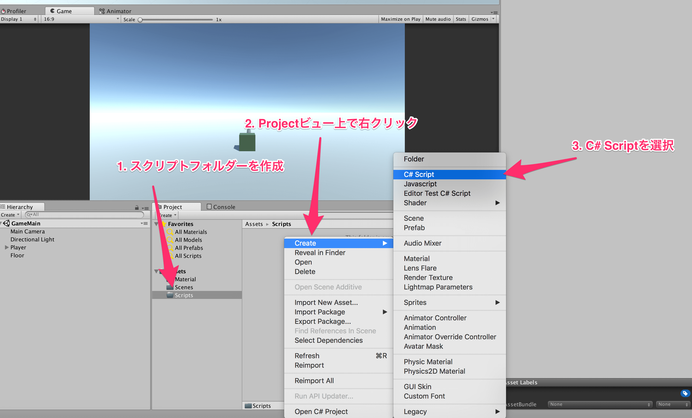
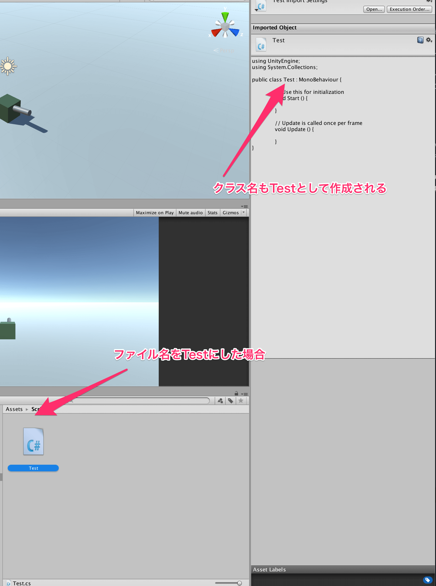
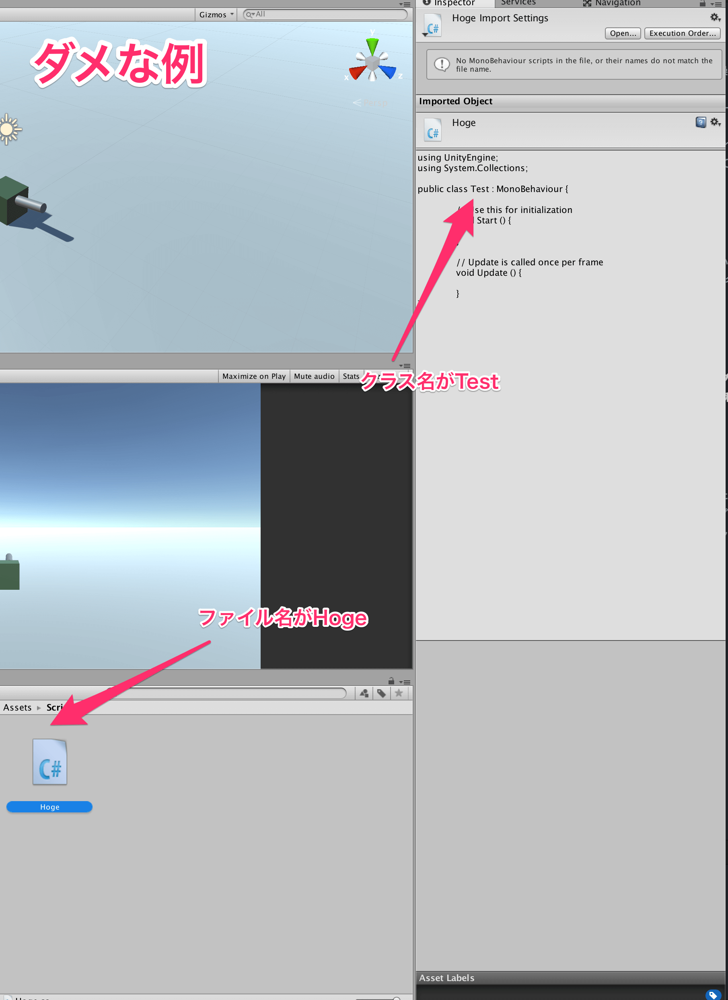
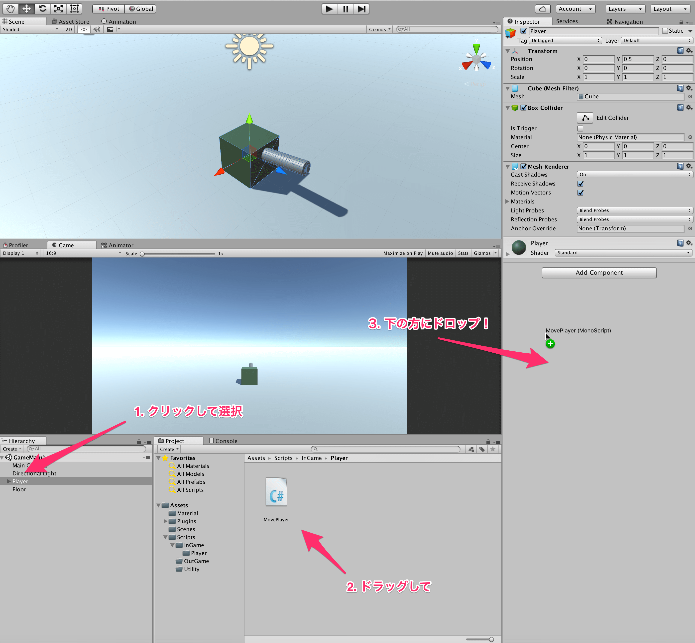
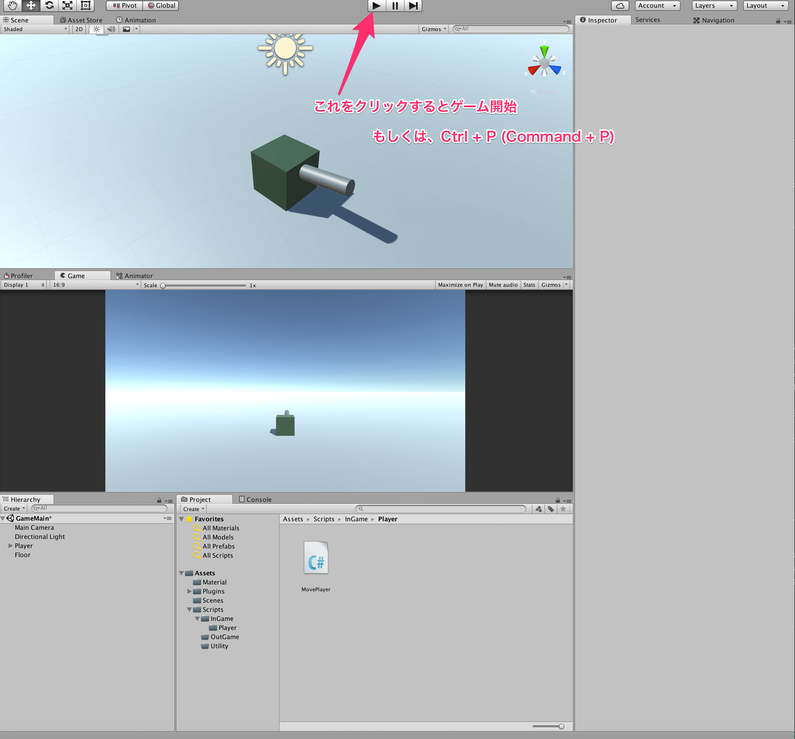

## 5. 自機を操作しよう

今回は、遂にスクリプトを作成して、前回までで作成した自機を操作してみましょう。  
スクリプトの作成は、マテリアルを作ったのと同様にProjectビュー上で右クリックし、Createにカーソルを合わせ、*C# Script* を押します。  
実際には、JavaScriptという選択肢もありますが、実務で使用されるものはほぼ100% C#ですし、より複雑なゲームを作成しようとするとやはりC#が必要になると思われるので、C#にしておきましょう。  



すると、スクリプトが作成され、名前を入力する状態になると思います。  
Unityエディタ上からスクリプトを作成すると、ここに入力された名前が、クラスの名前になります。  



また、重要なことなのですが、**C#スクリプトの名前とそのスクリプトに記載されているpublicクラスの名前が一致していない場合は、そのスクリプトは利用できない** ので注意しましょう。  



初心者の内にやりがちなミスとしては、一度スクリプトを作成したあとに、そのスクリプトの名前を変更してしまう場合で、この場合は初めてスクリプトを作成したときのように勝手にクラスの名前が変わったりはしないので注意しましょう。

さて、コードを書き始めましょう。  
今回は、キー入力とtransformを変更することによる移動を学びます。  
以下に作成すべきコードを示します。


````cs
using UnityEngine;
using System.Collections;

public class MovePlayer : MonoBehaviour {

    //移動スピード設定
    private const float move_speed_ = 0.2f;

    private void Update() {

        if (Input.GetKey(KeyCode.LeftArrow)) {
            Vector3 pos = transform.position;
            pos.x -= move_speed_;
            transform.position = pos;
        } else if (Input.GetKey(KeyCode.RightArrow)) {
            Vector3 pos = transform.position;
            pos.x += move_speed_;
            transform.position = pos;
        } else if (Input.GetKey(KeyCode.DownArrow)) {
            Vector3 pos = transform.position;
            pos.z -= move_speed_;
            transform.position = pos;
        } else if (Input.GetKey(KeyCode.UpArrow)) {
            Vector3 pos = transform.position;
            pos.z += move_speed_;
            transform.position = pos;
        }
    }
}
````

では、コードの説明をしていきます。  
まず、Unityにおいて、毎フレーム実行してほしい事柄はUpdate関数を用意して、その中に記述します。
このような関数はイベント関数と呼ばれ、Updateの他によく使うものとしては、プレハブのインスタンス化直後に呼び出されるAwake,初めてUpdateが呼ばれる直前に呼ばれるStartや、物体同士の衝突時によばれるOnCollisionEnterなど様々なものがあります。  
これらはすべてUnityを使う上で必須なので、これからの講座で出来る限り順をおって説明していきたいと思います。  
早く気になる方は[イベント関数](https://docs.unity3d.com/jp/current/Manual/EventFunctions.html)や、[イベント関数の実行順](https://docs.unity3d.com/ja/current/Manual/ExecutionOrder.html)を見ると良いでしょう。  

コードの説明に戻ります。  
Update内でキーボードの入力を受けつけ、もし入力が合った場合はその入力が合った方向に物体を移動させるということを行っています。  
*Input.GetKey* によってキーが押されている間trueが返ります。  
どのキーかどうかは、*KeyCode.キー名* で指定します。
今回は、上下左右のキーで移動できるようにしました。  

次に、どのキーが押されているか判定を取ったら、その方向に物体を移動させます。  
物体の移動やスケール、回転等を司るのは、transformという変数です。  
transformが持つpositionの値を変更してやれば、物体の位置が変わっていくわけです。  
ここで、一つ注意点があります。  
**tramsform.positionは、position.x,position.y,position.zをそれぞれ持ちますが、これらを直接書き換えることはできません。**  
理由は、C#の勉強をすればわかると思います。  
とにかく、直接は書き換えられないため、一旦positionを別の変数に代入して、そちらの値を書き換えてから、transform.positionに代入してやる必要があります。

このスクリプトが完成したら、シーン上に配置されているPlayerオブジェクトにアタッチ(AddComponent)してやりましょう。
アタッチの方法は、マテリアルのときと同様で、ヒエラルキー上のPlayerを選択して、インスペクタにPlayerを表示させます。  
その後、スクリプトを下の方にドラッグ・アンド・ドロップすればアタッチ完了です。



ここまでやったら、一度シーンを保存しておきましょう。  
シーンの保存は、Ctrl + S(Macの場合はComand + S)でできます。  
シーン名は、GameMainとでもしておきましょう。
シーンを保存しないと、配置したものなどが戻ってしまうため、こまめにCtrl + S を押してシーンを保存する癖をつけておきましょう。

最後に、Ctrl + P か、Unityエディタ上の再生ボタンを押して、実行してみましょう。  
無事プレイヤーが動いていたら成功です！



[←マテリアルを作ろう](./MakeMaterial.md) | [Next→](./MakeMaterial.md)

[目次に戻る](../../README.md)  
