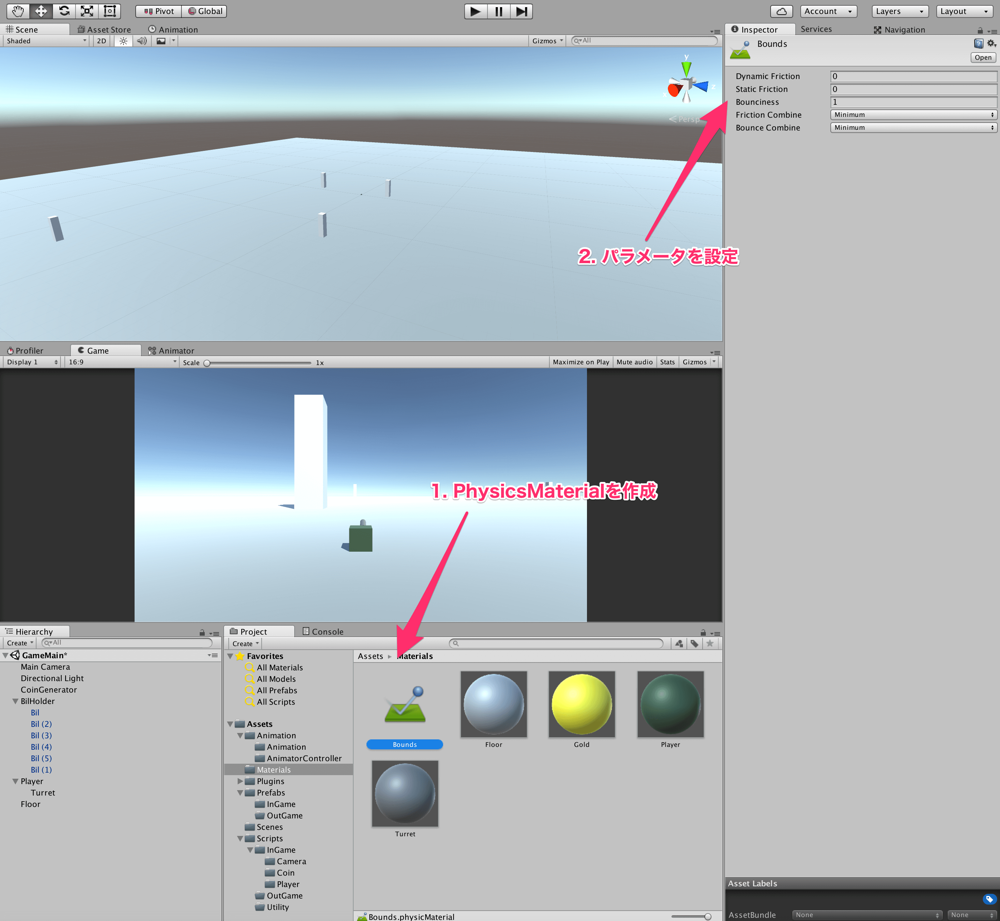
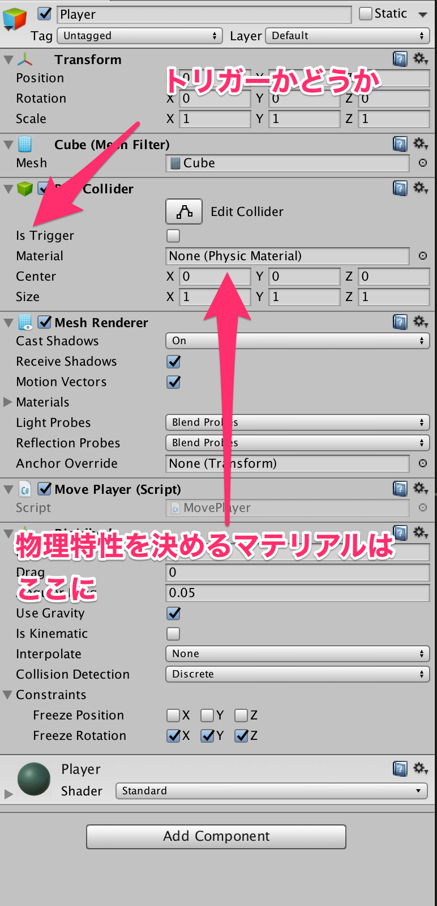
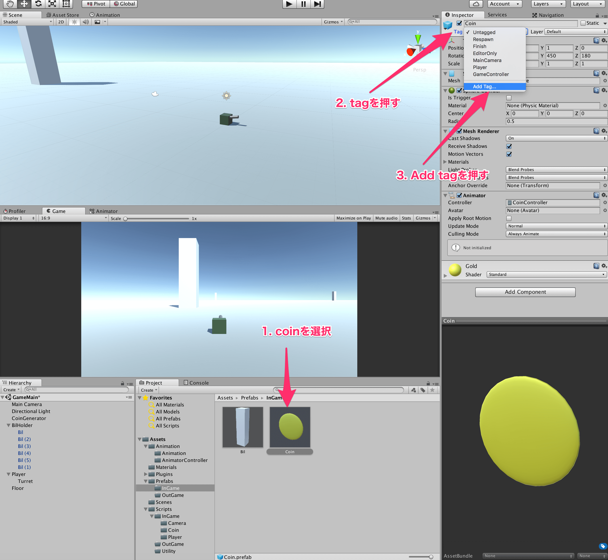
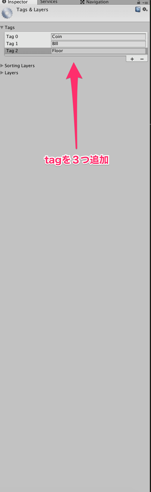
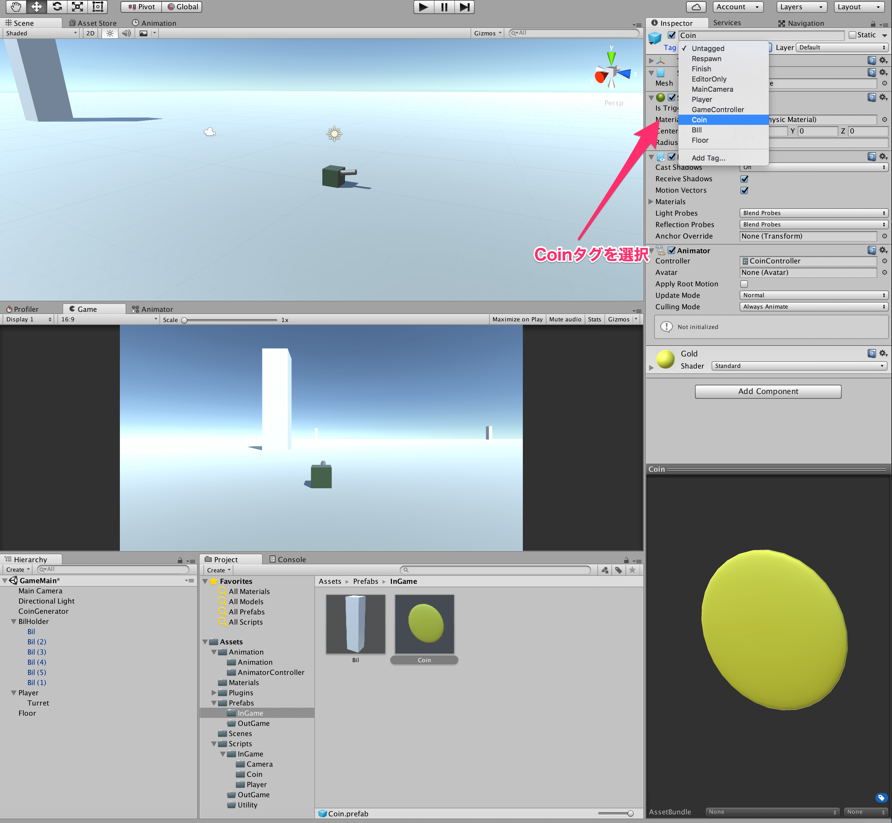
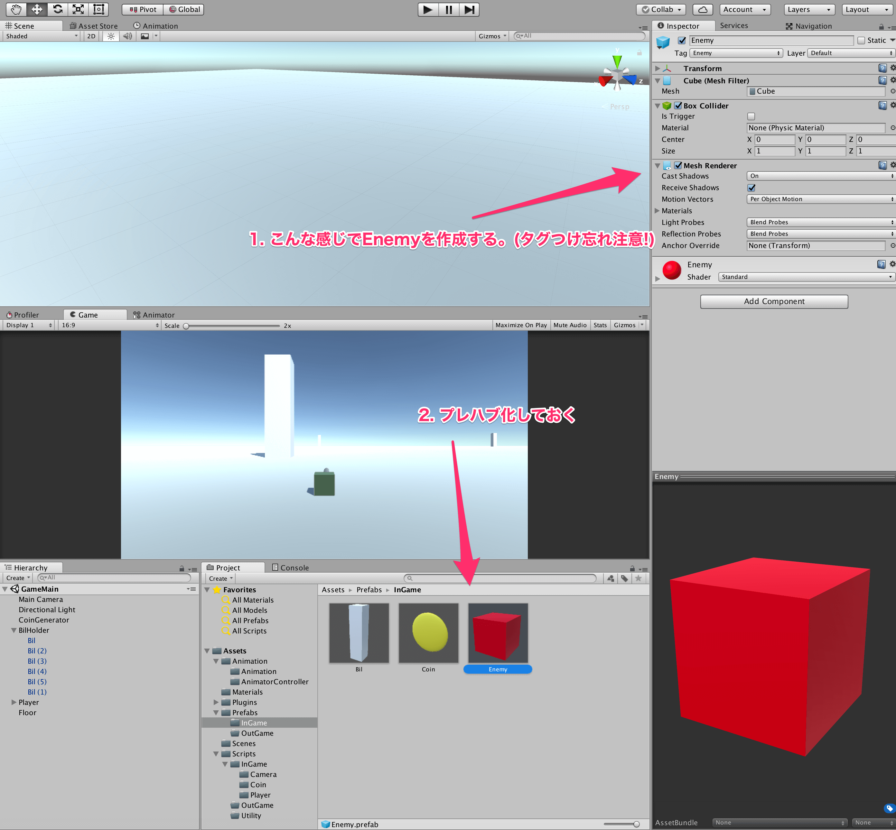

## 9. 衝突判定のイベントについて学ぼう

今回は、Unityにおける衝突判定について学んでいきましょう。  
前回もお話しましたが、Unityにおける当たり判定はColliderコンポーネントにより実現されています。  
そこで、Colliderコンポーネントを少し見てみましょう。  
まず、Colliderのマテリアルについて説明します。  
これは、普段のオブジェクトのマテリアルと同様に、Colliderの性質を決めるものです。  
Colliderのマテリアルは、PhysicsMaterialというものを作成して利用します。  
今回のゲームでは、PhysicsMaterialを使用するところはないと思いますが、一つ例として下に示しておきます。  



これは、反発係数を1として摩擦を0としたPhysicsMaterialで、これをColliderのマテリアルの欄に入れると適用されます。  
同様に、様々な物理特性をもつオブジェクトを作れるので、PhysicsMaterialも扱えるようになっておくと良いでしょう。  
それぞれのパラメータの意味に関しては、[PhysicsMaterial](https://docs.unity3d.com/ja/current/Manual/class-PhysicMaterial.html)を見て下さい。  

続いて重要なのは、IsTriggerというチェック欄です。  
ここにチェックを入れると、その物体は衝突はしないが、その範囲に入ったというイベントだけが取得できます。  
例えば、入ると回復ができるゾーンなどを作るとします。  
この場合、そのゾーンに入らなければならないため、衝突判定は取りたくないですがその範囲に入ったというイベントは欲しいはずです。  
そういうときは、IsTriggerにチェックを入れます。  



では、今回のゲームでもこれらのイベントを活用しましょう。  
まずは、プレイヤーがコインに触れたらコインを取得した判定を取るようにしましょう。  
コインを取得したらやるべきことは、プレイヤーのコインの枚数を保持するステータスを1増やすことと、コインをステージ上から消すことです。  
まずは、コインの枚数を保持するステータスを増やすことから始めましょう。  
以下のようなスクリプトを作成して、プレイヤーにアタッチしましょう。  

````cs
using UnityEngine;
using System.Collections;

public class PlayerStatus : MonoBehaviour {

    private int coin_num_;

    private void Awake() {
        coin_num_ = 0;
    }

    private void OnTriggerEnter(Collider other) {

        //もし、衝突対象がコインなら
        if (other.tag == "Coin") {
            ++coin_num_;
        }

    }
}
````

OnTriggerEnterはUnityのイベント関数で、IsTriggerがOnになっている物体と衝突したときに、呼び出されます。  
ここで、重要なのは、**Unityの衝突イベントが呼ばれるには、Rigidbody + Colliderがぶつかる方かぶつかられる方についている必要がある**　ことです。  
今回は、Playerに、RigidbodyとColliderがついていて、コインはIsTriggerにチェックの付いたColliderがついているのでこのイベントが呼び出されます。

次に、OnTriggerEnterの中のif文で、tagという変数を見ています。  
これは、Unityエディタ上で設定できるもので、プレイヤーや敵、障害物などを区別するためにつけることができます。  
今回は、コインに対してCoinというタグが付いている前提で、衝突されたときにそれがコインであるかどうかを確認するためにtagを見ています。
なので、コインにcoinというタグを付けましょう。  
タグを付けるには、コインのPrefabをクリックして、Tagという欄をクリックして、AddTagを押します。



すると、下のような画面になると思うので、そこでcoinという名前のタグを作ってやります。  
また、ついでに、Billと、Floorというタグも作っておきましょう。  



そして、作ったタグをそれぞれに付けておきましょう。  
タグを付けるには、先程のようにtagの横を押して、つけたいタグを選択します。  
Playerタグは常に存在しているので、プレイヤーにはPlayerタグを、コインにはCoinタグを、ビルにはBilタグを、床にはFloorタグを付けておきましょう。



また、コインのColliderのIsTriggerにチェックを付けておきましょう。  
これでPlayer側からみたコインの取得判定は取れました。  

今度は、コイン側から見た衝突判定をとり、Playerと衝突したらコインが消滅するようにしましょう。  
そのためには、以下のスクリプトを作成して、コインにアタッチしましょう。  

````cs
using UnityEngine;
using System.Collections;

public class CoinDestroy : MonoBehaviour {

    private void OnTriggerEnter(Collider other) {
        if (other.tag == "Player") {
            Destroy(gameObject);
        }
    }
}
````

上記のスクリプトで新しいものはDestroyだけかと思います。  
これは、フィールド上に存在するオブジェクトを引数に与えてやると、そのオブジェクトを削除します。  
今回は、自分自身を表すgameObject変数を与えたため、プレイヤーが衝突したときに自分が削除されます。  
これにより、コインにこのスクリプトをアタッチすれば、プレイヤーが取得したようになるのです。  

では、ゲームを実行して、Iキーを押してコインを発生させてみて、取りに行ってみましょう。  
無事、取得できれば完成です。  

次に、当たってはいけない敵を作ってみましょう。  
ひとまず、敵は常に静止していることにして作成します。  
敵はCubeオブジェクトを作成して名前をEnemyに変更し、赤色のマテリアルをつけてプレハブ化しておきましょう。  
また、Enemyタグを新しく作成し、Enemyタグを付けておきましょう。
どれも今までの章で説明してきた内容で作成できるはずなので、わからない場合は戻って復習しておきましょう。  



敵が作成できたら、PlayerStatusスクリプトを以下のように編集しておきましょう。  

````cs
using UnityEngine;
using System.Collections;

public class PlayerStatus : MonoBehaviour {

    private int coin_num_;

    private void Awake() {
        coin_num_ = 0;
    }

    private void OnTriggerEnter(Collider other) {

        //もし、衝突対象がコインなら
        if (other.tag == "Coin") {
            ++coin_num_;
        }

    }

    private void OnCollisionEnter(Collision other) {

        if (other.transform.tag == "Enemy") {
            //ゲームオーバー
            Destroy(gameObject);
        }

    }
}
````

上のスクリプトで説明していないのは、OnCollisionEnterというイベント関数のみです。  
OnCollisionEnterは、OnTriggerEnterとは違い、衝突する物体同士がIsTriggerにチェックがついて居ない場合に呼ばれます。  
このとき、OnTriggerEnterとは異なり引数がCollision型となっているので、注意しましょう。  
当たり判定に関するイベントに関してはまだいくつか種類があるので、[UnityのRigidbodyとColliderで衝突判定 - Qiita](http://qiita.com/yando/items/0cd2daaf1314c0674bbe)あたりの記事を読んで勉強しておきましょう。  
やっていることは、コインを取得のときと同様で、敵が当たってきた場合はプレイヤーをDestroy、つまり削除しています。  
この場合はプレイヤーが死ぬことになるので、ゲームオーバーを意味します。  

それでは、適当に敵を配置して、当たって見ましょう。  
プレイヤーが消えれば完成です。といいたいのですが、プレイヤーが消えると以下のようなエラーが大量にConsoleに出力されたと思います。  
長くなってしまうので、この原因は次回解明することにします。  

[←Rigidbodyを使ってみよう](./UseRigidbody.md) | [ログについて学ぼう→](./LearnDebug.md)

[目次に戻る](../../README.md)  
