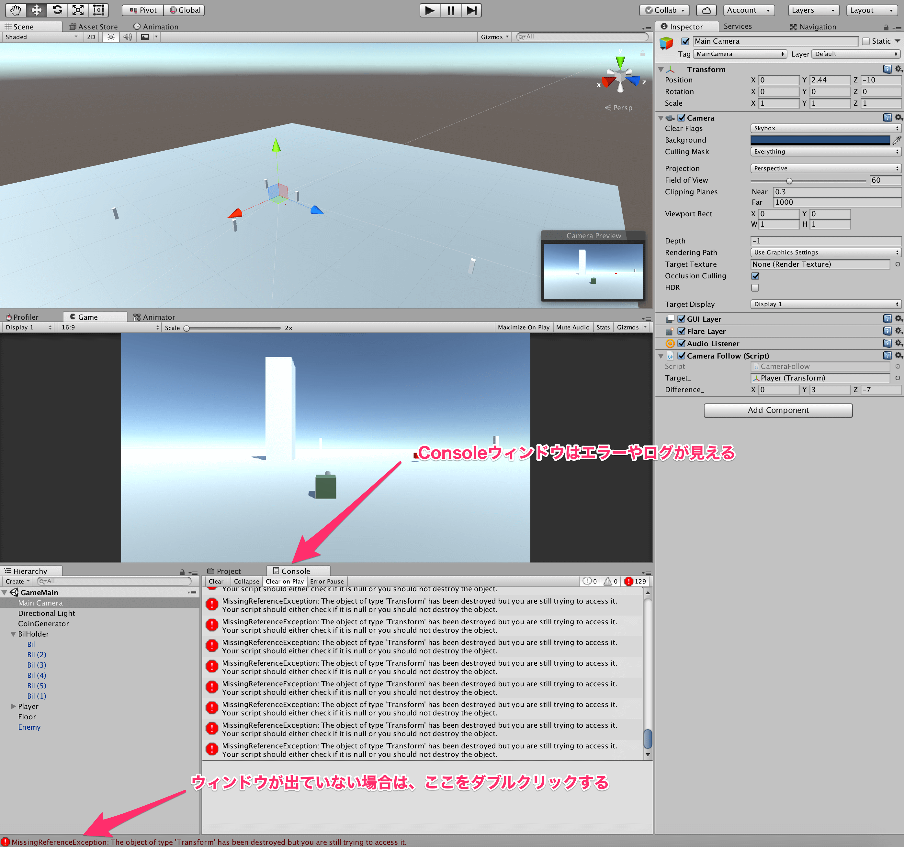

## 10. デバッグについて学ぼう

前回の最後に現れた謎のエラーについて原因を解明していきます。  

まずは、Consoleウィンドウを開きましょう。  
ConsoleはAnimatorやAnimationウィンドウなどと同様にWindowから開くか、Unity下部のメッセージをダブルクリックすることで開けます。  
Consoleは非常に便利かつ重要なので、覚えておきましょう。  



エラーメッセージを見てみましょう。

````
MissingReferenceException: The object of type 'Transform' has been destroyed but you are still trying to access it.
Your script should either check if it is null or you should not destroy the object.
UnityEngine.Transform.get_position () (at /Users/builduser/buildslave/unity/build/artifacts/generated/common/runtime/TransformBindings.gen.cs:26)
CameraFollow.LateUpdate () (at Assets/Scripts/InGame/Camera/CameraFollow.cs:13)
````

プログラムにおいて、エラーメッセージは非常に重要で、ここを見れば解決できることは非常に多いです。  
今回は、どうやらMissingReferenceExceptionと書いてある通り、参照が失われていることがわかります。  
参照とは、殆ど言葉の通りで、他のスクリプトやオブジェクトから監視されている状態だと考えておいて下さい。  
プレイヤーが消えてしまったので、プレイヤーを監視していたものが、監視対象がいなくなって困っているような感じでしょうか。  
以下エラーメッセージを読み進めると、  
at　Assets/Scripts/InGame/Camera/CameraFollow.cs:13  
という記述が見て取れます。  
これは、CameraFollow.csというスクリプトの13行目が良くないよと言ったような感じで、このエラーの原因となっている部分を示してくれています。  

今回の原因はというと、CameraFollowはPlayerオブジェクトのpositionを取得していたのが、PlayerオブジェクトがDestoryされたことにより、positionが取得できなくなってしまったことです。  

これを改善するために、CameraFollow.csを以下のように修正しておきましょう。

````cs
using UnityEngine;
using System.Collections;

public class CameraFollow : MonoBehaviour {

    [SerializeField]
    private Transform target_;

    [SerializeField]
    private Vector3 difference_;

    private void LateUpdate() {
        if (target_ != null) {
            transform.position = target_.position + difference_;
        }
    }
}
````

以前のスクリプトにif文が追加されただけです。  
このif文は、target、つまり監視対象がいるかどうかを確かめて、いる場合のみ追従すると言ったことを行っています。  
監視対象が居ない場合は、targetは *null* という特殊な値になります。  
基本的に、オブジェクトがDestroyされた場合や、最初から取得できていなくて中身がない場合はnullという値になっていると考えて下さい。(前者に関しては正確には少し違うので勉強してください)  

これでエラーが出なくなったはずなので、実行してみましょう。  
敵に当たっても、エラーが出ないと思います。  

続いて、デバッグをする方法を教えていきます。  
以前に、プレイヤーが取ったコインの枚数を変数に保持していたと思います。  
この現在持っているコインの枚数を、コインを取ったときにConsoleに表示したいと思います。  
PlayerStatus.csスクリプトを以下のように編集します。  

````cs
using UnityEngine;
using System.Collections;

public class PlayerStatus : MonoBehaviour {

    private int coin_num_;

    private void Awake() {
        coin_num_ = 0;
    }

    private void OnTriggerEnter(Collider other) {

        //もし、衝突対象がコインなら
        if (other.tag == "Coin") {
            ++coin_num_;
            Debug.Log(coin_num_);
        }

    }

    private void OnCollisionEnter(Collision other) {

        if (other.transform.tag == "Enemy") {
            //ゲームオーバー
            Destroy(gameObject);
        }

    }
}
````

このように、値を確かめたいときにはDebug.Logを使用しましょう。  

また、Debug.LogErrorや、Debug.LogWarningなど様々な種類のログがあるので、なっていてはいけない値のときはDebug.LogErrorでエラー文を出すなど、使い分けていきましょう。  


[←衝突判定のイベントについて学ぼう](./LearnBounds.md) | [Next→](./UseAnimator.md)

[目次に戻る](../../README.md)  
