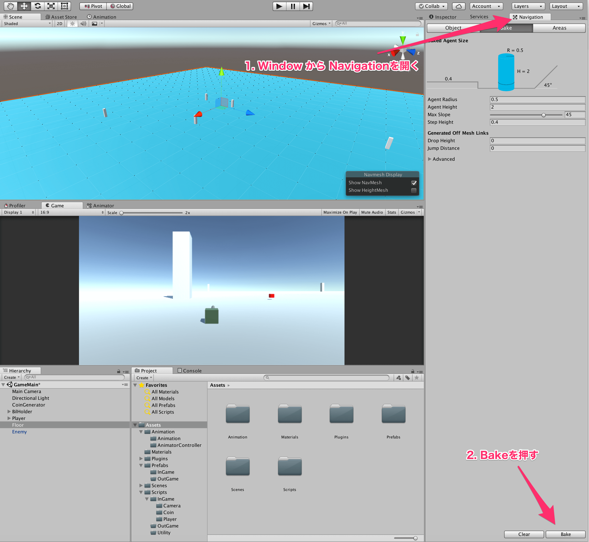

## 11. 敵を動かそう

今回は、以前作成した動かない敵を動くようにしてみましょう。  
フィールド上で、プレイヤーに対して一定の範囲内にいるときはプレイヤーを追尾して、範囲外のときは適当に巡回するようにしてみましょう。  

普通に作ろうと思えばこれはなかなかに難しい処理になってしまいますが、UnityにはNavMeshという経路探索を行うAIが手軽に作れる機能があるので、今回はこれを利用してみましょう。  
NavMeshを利用するには、
1. ステージを作成する
2. ステージのオブジェクトを Navigation Static に変更  
  このとき、ビルも一つ一つ設定するようにしてください
3. WindowからNavigationを開いて、Bakeボタンを押す  




これにより、準備は完了です。

あとは、自動で移動させたいもの、今回で言うとEnemyに対してNavMeshAgentコンポーネントをアタッチしておきましょう。  
これにより、スクリプト側から目的地を設定してやればその目的地に対して障害物を避けながら近づくようになります。  

最後に、今回利用するスクリプトを以下に示します。  

````cs
using System.Collections;
using System.Collections.Generic;
using UnityEngine;
using UnityEngine.AI;

public class EnemyMove : MonoBehaviour {

    [SerializeField]
    private Transform player_;

    private NavMeshAgent agent_;

    //最新の目的地を保持
    private Vector3 pos_;

    private void Awake() {
        agent_ = GetComponent<NavMeshAgent>();
    }

    private void Start() {
        Patrol();
    }

    private void Update() {

        if (player_ == null) return;

        float player_distance = Vector3.Distance(player_.position, transform.position);
        float target_distance = Vector3.Distance(transform.position, pos_);

        if (player_distance < 50f) {
            pos_ = player_.position;
            agent_.SetDestination(player_.position);
        } else if (target_distance < 10f) {
            Patrol();
        }

    }

    private void Patrol() {

        float x = Random.Range(-100f, 100f);
        float z = Random.Range(-100f, 100f);

        pos_ = new Vector3(x, 0, z);

        agent_.SetDestination(pos_);
    }

}

````

少し長いですが、やっていることはそこまで難しくありません。  
初めに、UnityEngine.AIをusingしていることだけ注意しておきましょう。  

まず、NavMeshAgentをスクリプトで扱いたいため、GetComponentをしておきます。  
これは、Updateの中でNavMeshAgentを多用するため、そのたびにGetComponentをしていては処理が重くなってしまうからです。  

Update内では、敵とプレイヤーとの距離と、敵と現在の敵の目標地点との距離を計算しています。  
これによって、敵がプレイヤーの一定範囲内、今回で言うと距離が30fより小さい場合にはプレイヤーを追従し、それ以外の場合は目標地点をランダムに選んでその地点まで進むことを繰り返します。  

Patrol関数内では、UnityEngineのランダム関数を使っています。  
Random.Range(-100f,100f)とすると、-100から100までの値を実数値でランダムに取ります。  
引数に取る値が整数値の場合は、整数のみを返します。  
よく使うと思うので、覚えておきましょう。

最後に、NavMeshAgentが持つSetDestinationという関数は、目標地点を受けとり、その目標地点に向かって進むための関数です。  

このスクリプトをEnemyにアタッチし、実行してみましょう。  
このとき、インスペクタ上からPlayerをくっつけておくのを忘れないようにしましょう。  
すると、敵に近づくとプレイヤーの方へ接近してきて、離れると勝手に巡回していると思います。  
敵のスピードが遅いと思った場合は、NavMeshAgentコンポーネントのSpeedの値を調整しておきましょう。  

全ての設定が完了したら、Enemyプレハブに今の設定をApplyして、Enemyを何匹か適当な場所に配置しておくようにしましょう。


このように、Unityでは容易にAIも作ることができます。  
地形を判定して移動してくれるので、落下してしまうこともありません。  
そこまでパフォーマンスを追求しなくて良い場合は、使用してみてもよいかもしれません。

[←ログについて学ぼう](./LearnDebug.md) | [コルーチンを使おう→](./UseCoroutine.md)

[目次に戻る](../../README.md)  
