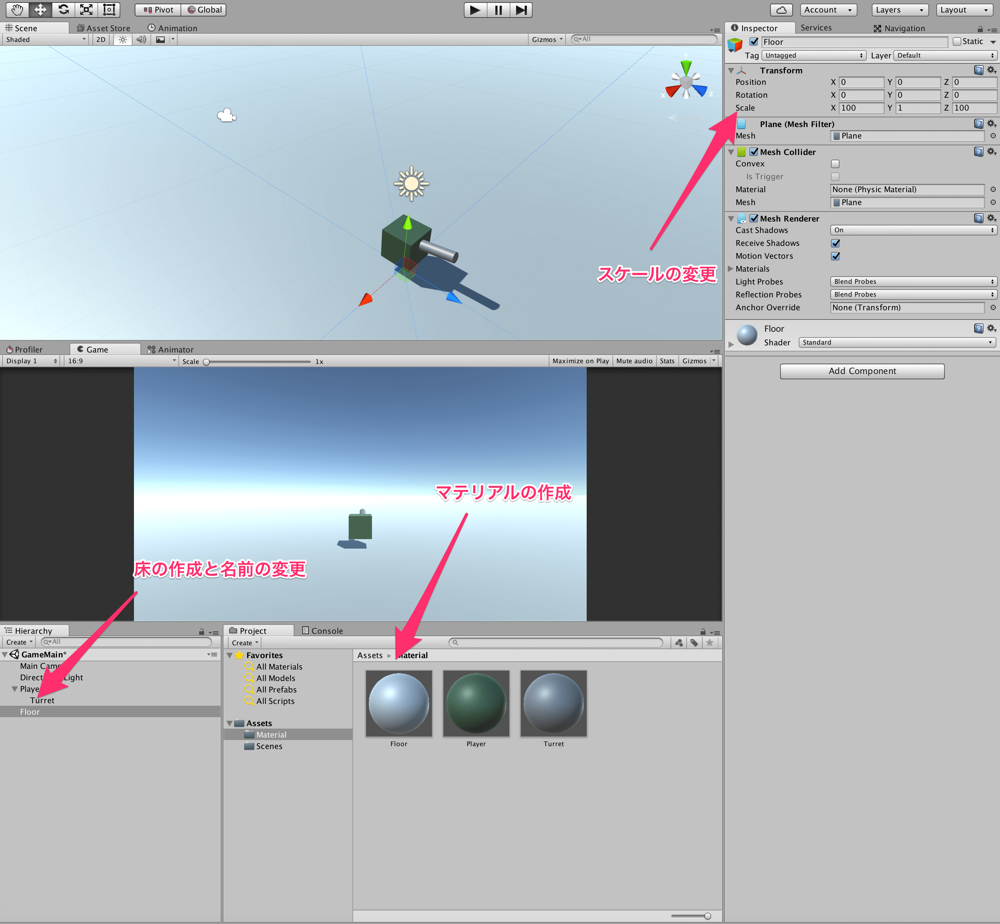

## 4. マテリアルを作ろう

前回作ったプレイヤーに色をつけてみましょう。  
色をつけるには、マテリアルというものを作成する必要があります。  
マテリアルは、シェーダーやテクスチャをまとめたもので、モノの色や表面の雰囲気(ざらざらとかつるつるとか)を表現するためのものであると認識しておけばよいと思います。  

マテリアルは、Projectビュー上で右クリックをして、Createにカーソルを合わせた後、Materialを押すことで作成されます。  
このとき、初めに言ったようにMaterialフォルダを作成しておき、そこにMaterialはまとめるようにすると良いでしょう。  

作成したマテリアルは、Playerのマテリアルなので、名前はPlayerにしておきましょう。  
また、このままでは色が白のマテリアルで、元の色と変わらないため、色を変えておきましょう。  
作成したマテリアルをクリックすると、インスペクタにそのマテリアルの情報が表示されます。  
その中の、Albedoという項目の右にあるカラーパレットをクリックしましょう。  
すると、カラーピッカーが表示されると思います。  
そこで、戦車のボディに合いそうな色に自分で調整しましょう。  

同様な手順を踏んで、砲塔のマテリアルも作ってみましょう。  
名前は、Turretにしておくとわかりやすいかもしれません。  

では、作成したマテリアルを自機に適用させていきましょう。  
マテリアルを適用させるには、適用させたいオブジェクト、今回はPlayerをクリックして、インスペクタの下の方に放り込みます。

同様に、砲塔に関してもマテリアルを適用させてみましょう。  
最終的に、以下のような感じになり、だいぶそれっぽくなりました。  

では、今までの回の復習として、フィールドにPlaneオブジェクトを作成し、スケールをx: 100 y: 1 z: 100　にすることで、地面を作りましょう。  
また、その床に対してマテリアルを適用させてあげてみてもよいかもしれません。  
床を作成するとプレイヤーとカメラが半分床に埋まってしまうかもしれませんが、そうなった場合は、プレイヤーとカメラのy座標を少し上にあげておきましょう。
最終的に、以下のようになりました。  

今後、このようにオブジェクトを作成し、スケールや回転、マテリアルを適用、といった操作を多く行うことになるので、わからなかった方は復習しておきましょう。  

[←自機を作ろう](./MakePlayer.md) | [Next→](./MakeMaterial.md)

[目次に戻る](../../README.md)  
