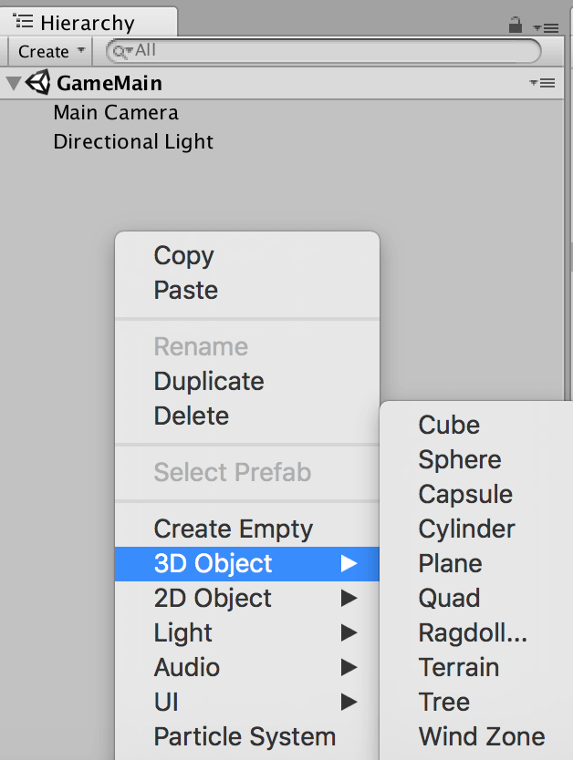
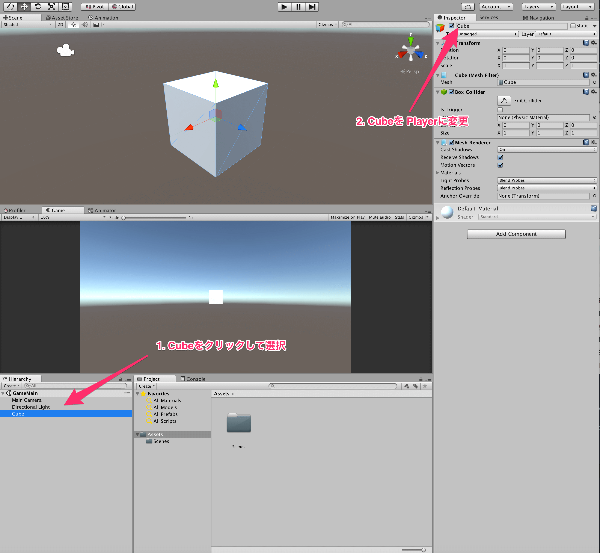
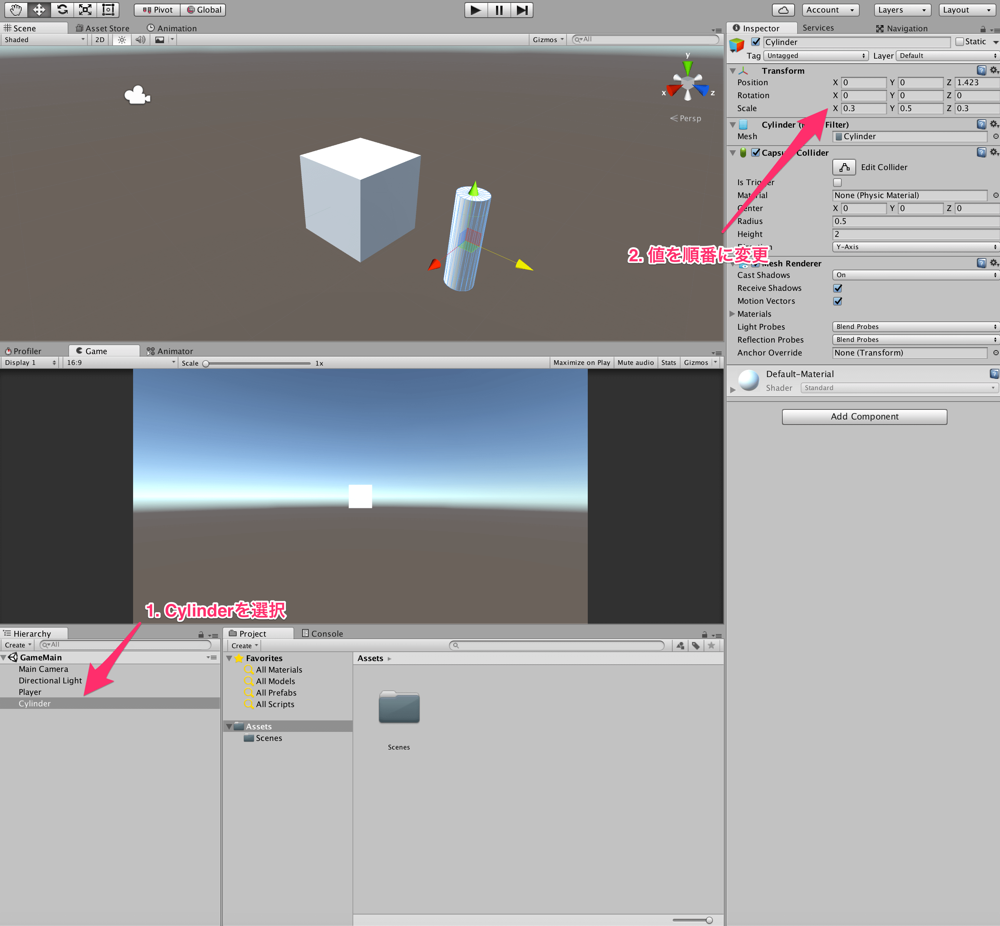
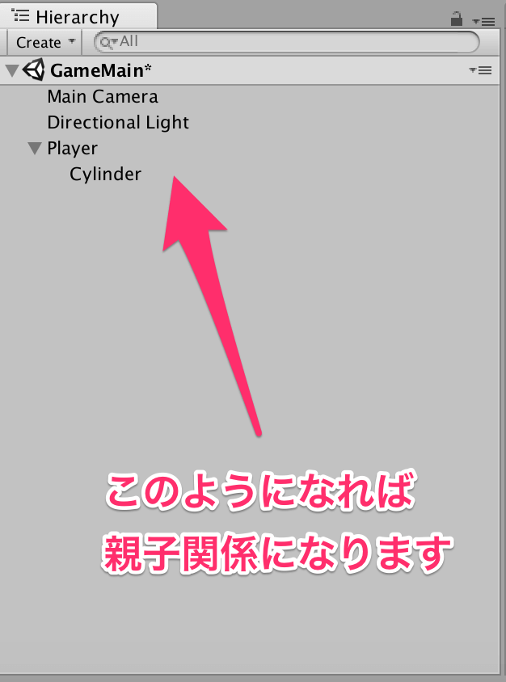
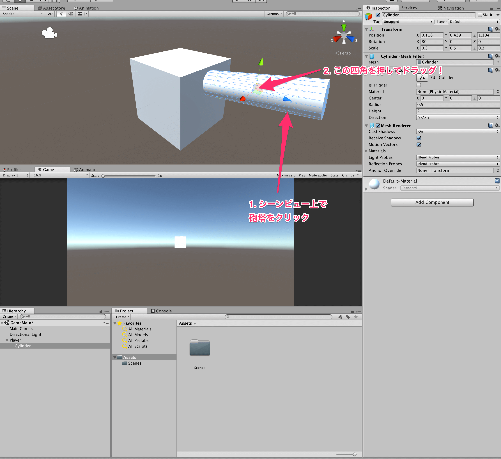

## 3. 自機を作ろう

いよいよゲーム制作に取り掛かりましょう。  
まずは、自機となる戦車を作ります。  
作りますと言ってもモデリングしろというわけではなく、今回はあくまでそれっぽく見えればいいやという感じで、Unityエディタ内で作れるプリミティブオブジェクトから形を似せていきます。

まず、ヒエラルキー上で右クリックをします。  
すると、メニュー一覧がでてくると思います。  
その中の、3DObjectというものにカーソルを合わせて下さい。  
ここで出ているものが、Unity内で作成できるプリミティブオブジェクトの一覧です。  
今回は詳細な説明は省きますが、概ね英語を読めば何かはわかるかと思います。  
気になる人は[プリミティブとプレースホルダーオブジェクト](https://docs.unity3d.com/jp/current/Manual/PrimitiveObjects.html)を見て下さい。  

まずはこの中のCubeを押してみましょう。  
すると、画面上に白い四角い物体が現れたかと思います。  
Unityではこのようにヒエラルキーにモノを置くと、シーン上にその物体が現れます。  
今作成したCubeに関して、ヒエラルキー上でクリックして、インスペクタから名前をPlayerに変えてみましょう。  

プログラミングと同様に、オブジェクトの名前というものは非常に重要です。  
常に自分や他の人から見て、そのオブジェクトが何なのかをわかりやすい名前にするように心がけましょう。  

次に、砲塔を作成します。  
先程と同じ要領で、今度はCylinderを作成しましょう。  
すると、円筒が画面上に現れたかと思います。  
このままだと、砲塔が機体とほぼ同じ大きさになってしまっているので大きすぎます。  
スケールをいじって、大きさを変えることにしましょう。  
ヒエラルキー上からCylinderをクリックして、インスペクタ上のScaleの値をx: 0.3 y: 0.5 z: 0.3 にしましょう。  

砲塔が小さくなったところで、自機にくっつけましょう。  
砲塔は常に自機と共に動くと思うので、CylinderをPlayerの子にしてしまうと良いです。  
子にするには、ヒエラルキー上で、CylinderをPlayer上にドラッグ・アンド・ドロップしましょう。  
子になると、座標は親からの相対位置になります。  
親が移動すると、子は親との位置関係を維持するように動きます。  

砲塔の角度も変更してあげましょう。  
角度を変更するには、スケールを変更したときと同様にインスペクタ上の値を変更してやれば良いです。  
今回は、x軸中心に80度回転させておきましょう。

シーンビュー上で砲塔(Cylinder)をクリックして、それっぽい位置に移動させましょう。  
クリックした後、真ん中の四角を押してドラッグすると自由に移動ができます。  
それぞれの色の矢印を押して、ドラッグするとその矢印の軸方向にのみ移動できます。  

最後に、シリンダーを砲塔だとわかるように名前をTurretに変更しておきましょう。  

[←ウィンドウの概要とフォルダーの作成](./Window and folder.md) | [マテリアルを作ろう→](./MakeMaterial.md)

[目次に戻る](../../README.md)  
