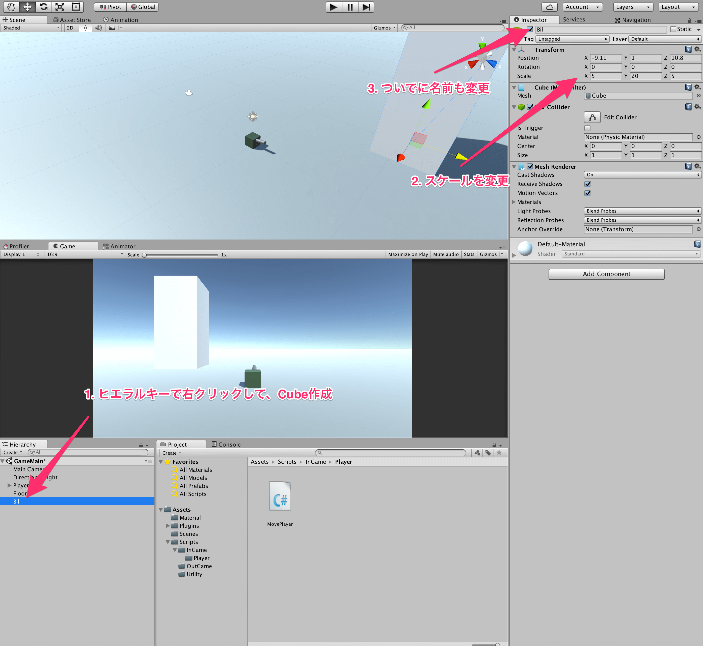
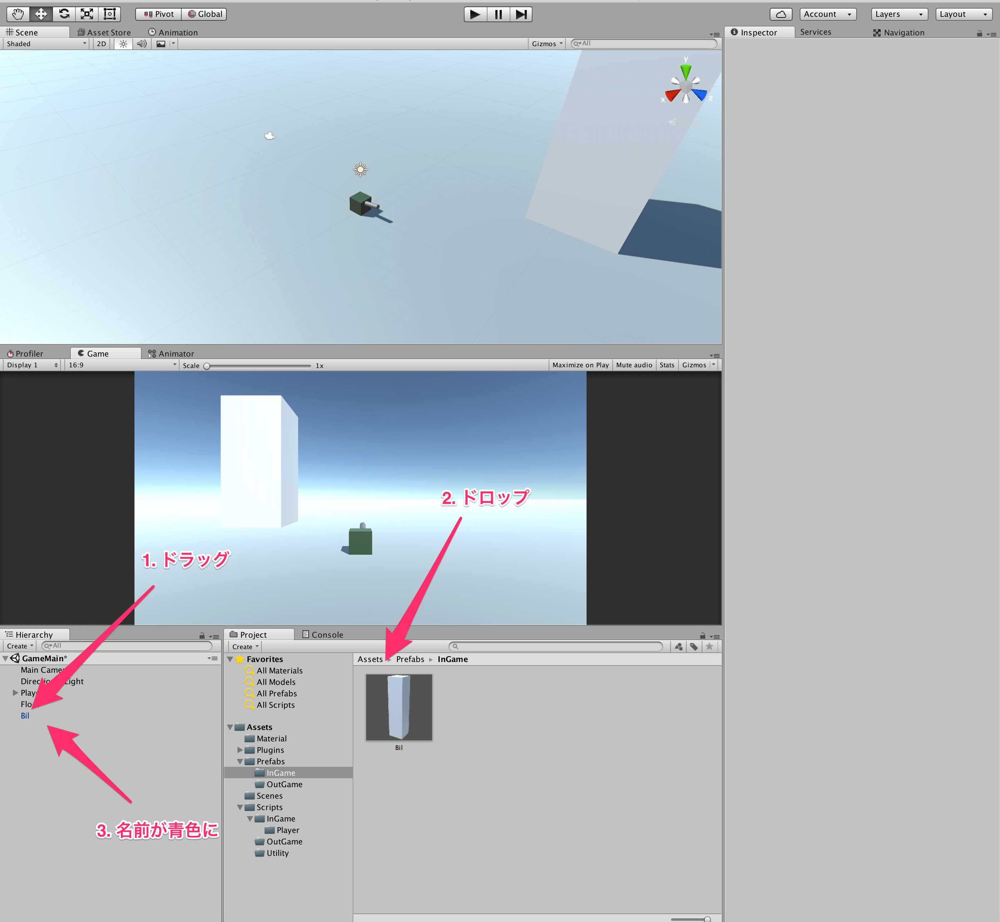
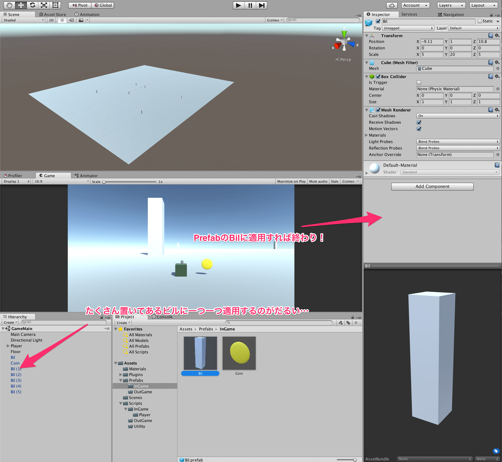
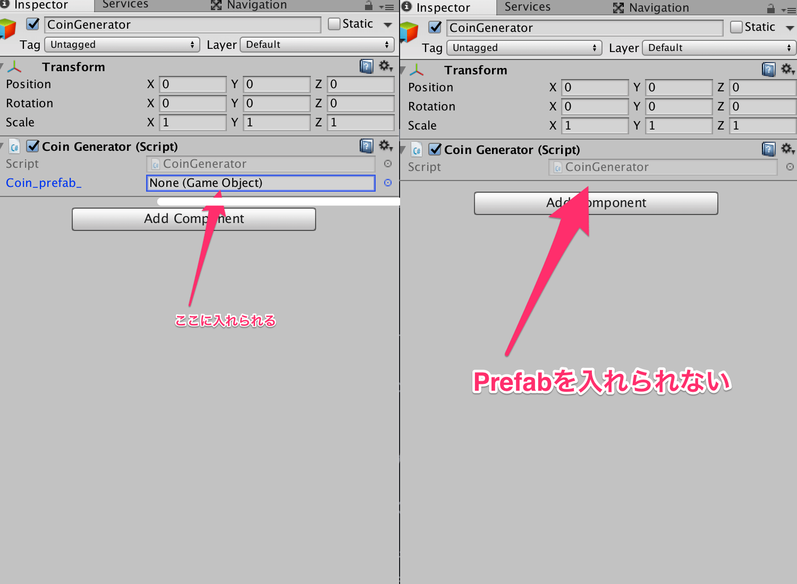
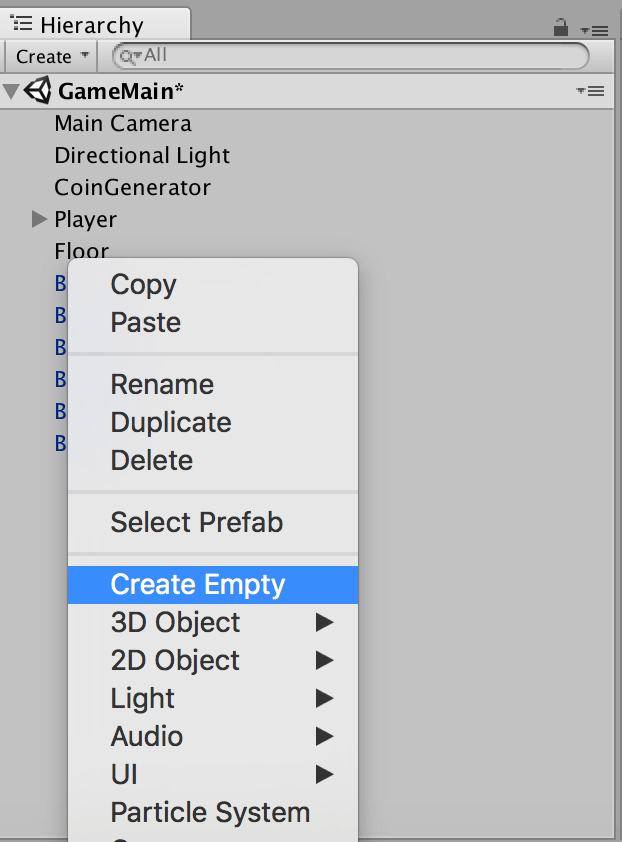
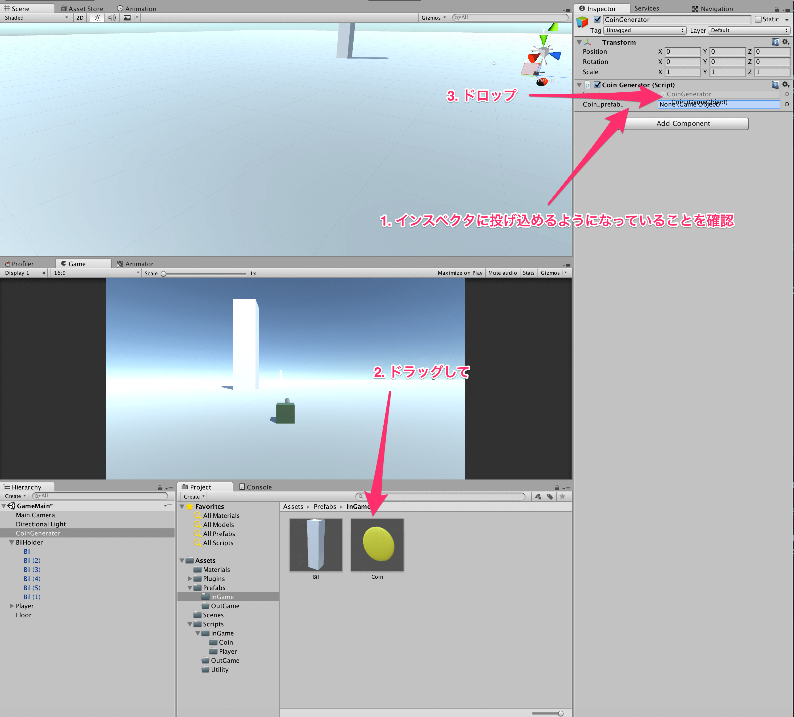
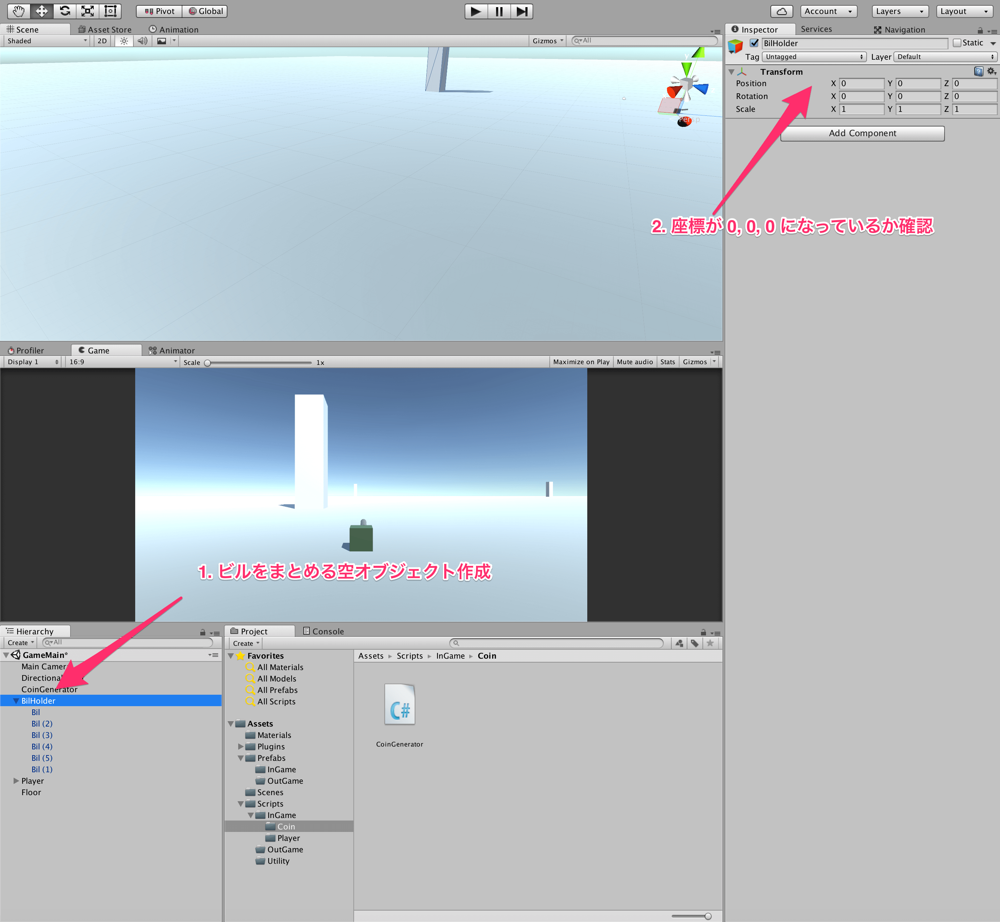

## 6. Prefabを作ろう

今回は、Unityを扱う上で必須とも言えるPrefabの作り方について学びましょう。  
Prefabは、あるオブジェクトを一括に変更することを楽にしたり、スクリプトからそのオブジェクトを作成できるようにする際に使います。  
それでは、実際にPrefabを作ってみましょう。  
フィールドに今はプレイヤーしかいないため、障害物となるようなビルを作ってみましょう。  
プレイヤーを作ったときのように、モデルを作るのではなくUnityのプリミティブオブジェクトを利用しましょう。  
今回は、Cubeオブジェクトを作成して、スケールをx: 5 y: 20 z: 5にしておきましょう。  



ここまでできたら、いよいよPrefabを作ります。  
やり方はとても簡単で、ヒエラルキーからプロジェクトの方に作成したオブジェクトをドラッグ・アンド・ドロップすれば終わりです。  
Prefabになっているオブジェクトは、名前が青色になるのでわかるはずです。  
今後、ビルを配置するときは、いま作成したPrefabをヒエラルキーにドラッグ・アンド・ドロップして作りましょう。



続いて、コインを作ってみましょう。
コインは、Sphereを作って、スケールをx:0.1 y:1 z:1にして作りましょう。  
また、マテリアルでコインに黄色をつけておきましょう。
完成したコインは先程のビルと同様にPrefab化しておきます。

今回、Prefab化したことで、ビルに関しては一括に扱いやすくなりました。  
例えば、今後ビルをたくさん配置してステージを構成すると思いますが、そのとき、配置したあとにビルに対して新しいマテリアルやスクリプトを適用したくなったとします。  
そういうときは、配置してあるオブジェクトではなく、Prefabに対してその変更を加えてやるだけで、配置したオブジェクト全てに対してその変更が加えられるわけです。



また、コインも同様に一括に扱いやすくなったと同時に、コインのような動的に生成をするオブジェクトはPrefab化しておくことで、スクリプトから生成できるようになります。  
以下に、Iキーを押すたびにコインを-100 から100までの範囲に出現させるというスクリプトを示します。

````cs
using UnityEngine;
using System.Collections;

public class CoinGenerator : MonoBehaviour {

    [SerializeField]
    private GameObject coin_prefab_;

    //public GameObject coin_prefab_; でもよいが、上を推奨

    private void Update() {
        if (Input.GetKeyDown(KeyCode.I)) {
            Instantiate(coin_prefab_, RandomCoinPos(), Quaternion.identity);
        }
    }

    //コインの生成位置をランダムに返す
    private Vector3 RandomCoinPos() {
        int pos_x = Random.Range(-90, 90);
        int pos_z = Random.Range(-90, 90);

        Vector3 pos = new Vector3(pos_x, 1, pos_z);
        return pos;
    }

}
````

順番に説明していきます。  
まず、どのPrefabを利用するのかをインスペクタから与えてやる必要があるため、privateな変数に対して *[SerializeField]* という属性をつけました。  
こうすることで、インスペクタからPrefabを入れてやることができるようになります。  
また、同様のことをするのに、アクセス指定子をpublicにしてやってもよいのですが、これよりはprivateで属性SerializeFieldを付けるほうが無意味なアクセスも防げてよいと思います。



次に、生成している部分のスクリプトです。  
Prefabからオブジェクトの生成にはInstantiate関数を用います。  
Instantiateは、引数にPrefabのオブジェクト、生成する位置、オブジェクトの向きを取ります。  
今回は、生成する位置はフィールド上のどこかになるように関数を作って、その返り値を使っています。  
オブジェクトの向きに関しては、基本的には今回と同じ内容を常に記述すればよいと思います。

では、スクリプトを利用できるように、CoinGeneratorという空オブジェクトを作り、そこにスクリプトをアタッチしておきましょう。  
空オブジェクトは、ヒエラルキー上で右クリックをして、CreateEmptyを押します。  



CoinGeneratorができたら、スクリプトをアタッチしましょう。
すると、インスペクタ上にCoin_prefab_ Noneという表示があると思うので、そこにコインのプレハブをドラッグ・アンド・ドロップしましょう。



空オブジェクトは、スクリプトをアタッチする場合や、生成するオブジェクトをまとめる場合などにも使えます。  
例えば、ビルをいっぱい配置するとヒエラルキーが汚くなるので、BilHolderなるものを作り、ビルは全てこの子に持つようにすることでヒエラルキーを整理できます。  
その際に、**空オブジェクトの座標を0,0,0にする** ようにだけ注意して下さい。



では、最後にシーンを保存して、ゲームを実行してみましょう。  
Iキーを押すたびにコインが生成されれば完成です。  

[←自機を操作しよう](./ControllPlayer.md) | [Animatorを使ってみよう→](./UseAnimator.md)

[目次に戻る](../../README.md)  
