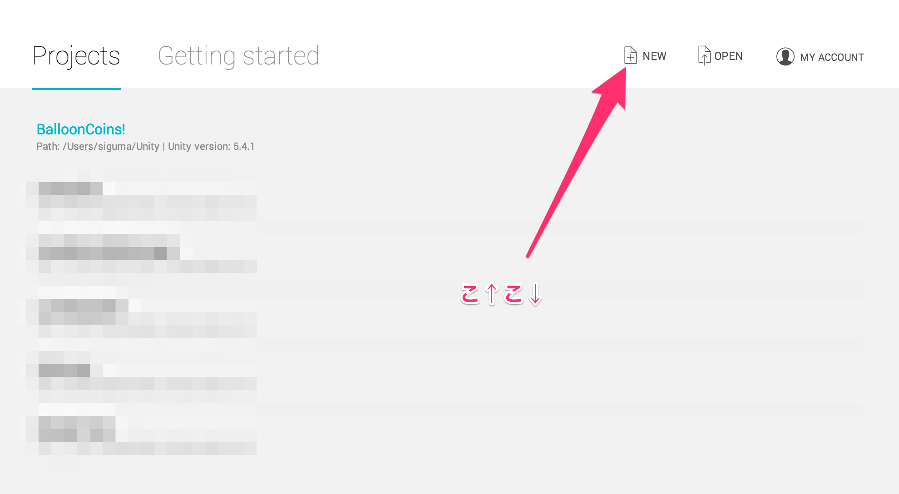
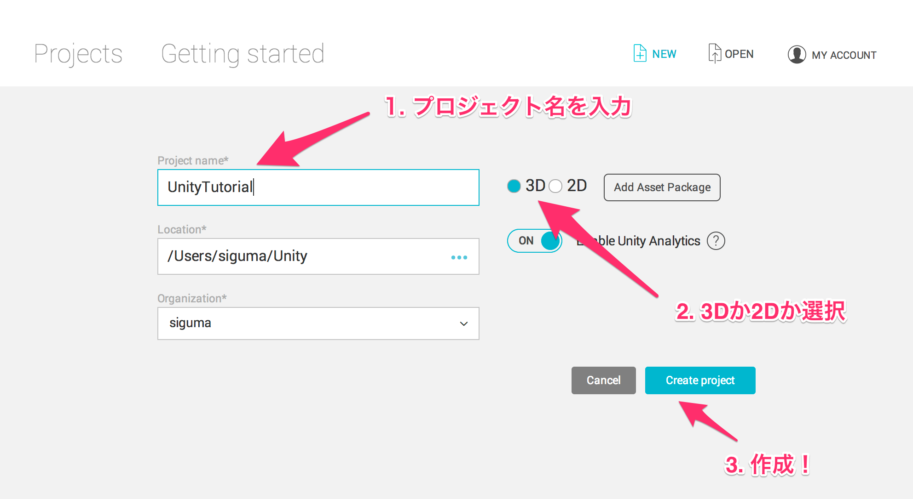

## 1. プロジェクトの作成
まず初めに、プロジェクトを作成します。  
以下の写真のようにNewボタンを押して新しいプロジェクトを作成します。  
ただし、以下の写真はMacOSの場合なので、Windowsの場合は多少表記が変わるかもしれません。  
今後、写真はすべてMacOS上のものとなるので、Windowsの方はあくまで参考程度に確認してください。  

次に、ProjectNameを入力してください。  
ここに入力するものは、ゲームのタイトルや決まっていない場合はそれに準ずるものであることが望ましいと思います。  

3Dか2Dの選択に関しては、プロジェクトの作成後にも変更することはできます。  
ここで3Dを選択した場合と2Dを選択した場合の違いは、様々あります。  
例えば、2Dを選択した場合はインポートする画像が2Dスプライトとして認識されるようになります。  
その他の違いに関しては、Unityマニュアルの[2D/3Dモード設定](https://docs.unity3d.com/jp/current/Manual/2DAnd3DModeSettings.html)で確認して下さい。  

プロジェクトを作成する場所の変更はLocationを押して変更して下さい。  

全ての設定が完了したら、CreateProjectを押して、プロジェクトを作成します。  

[→ウィンドウの概要とフォルダーの作成](./Window and folder.md)

[目次に戻る](../../README.md)  
