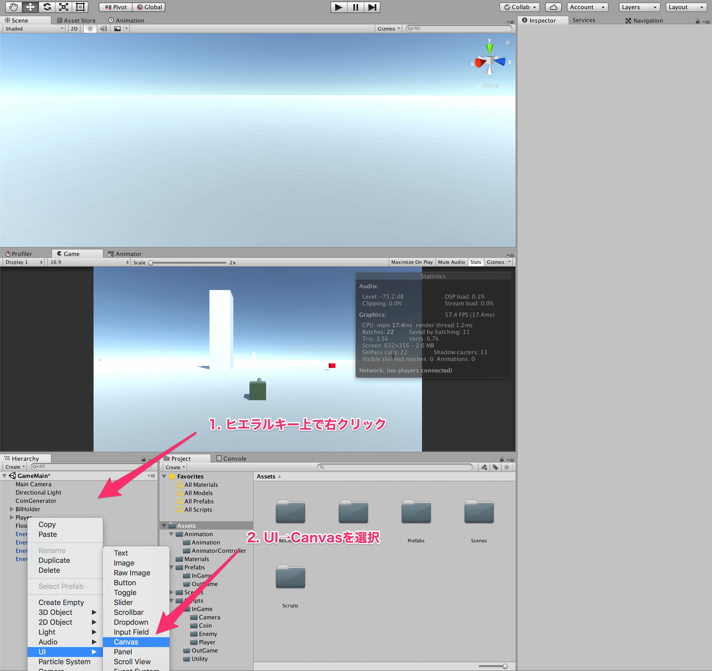
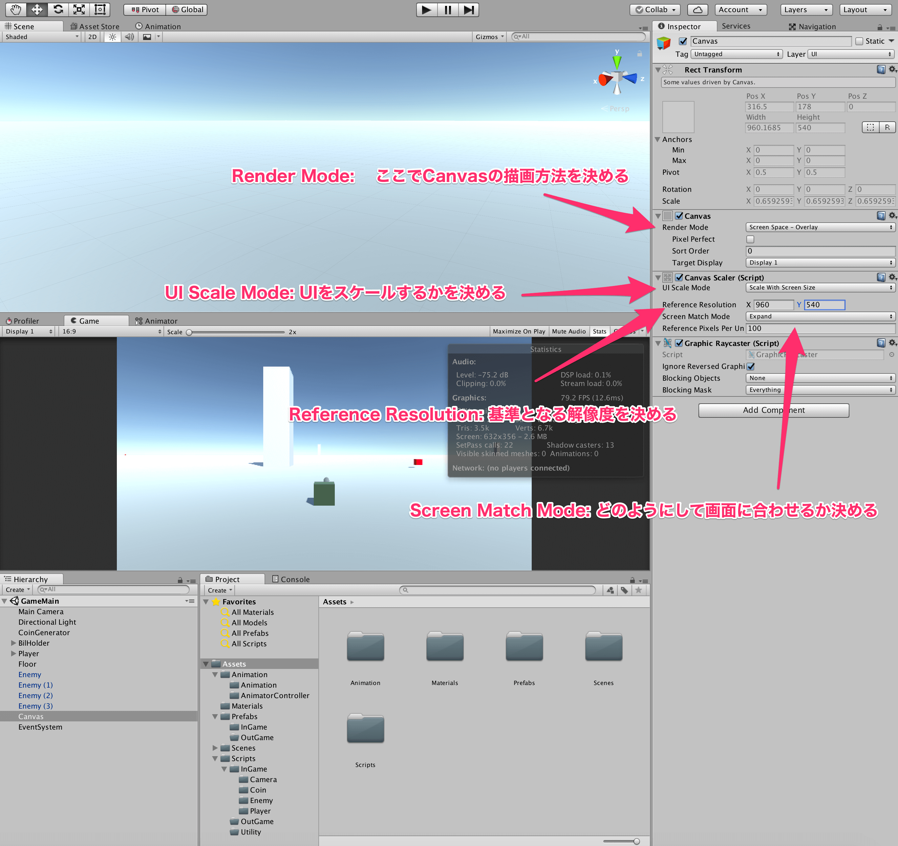
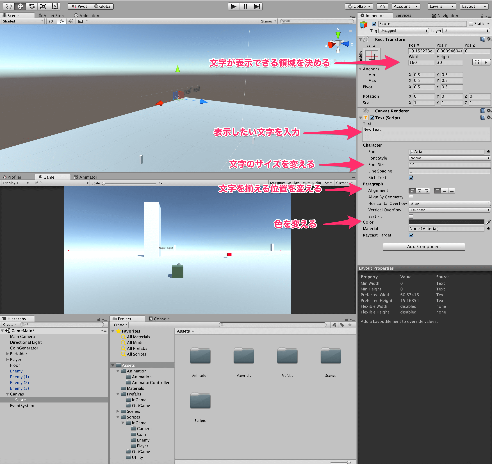
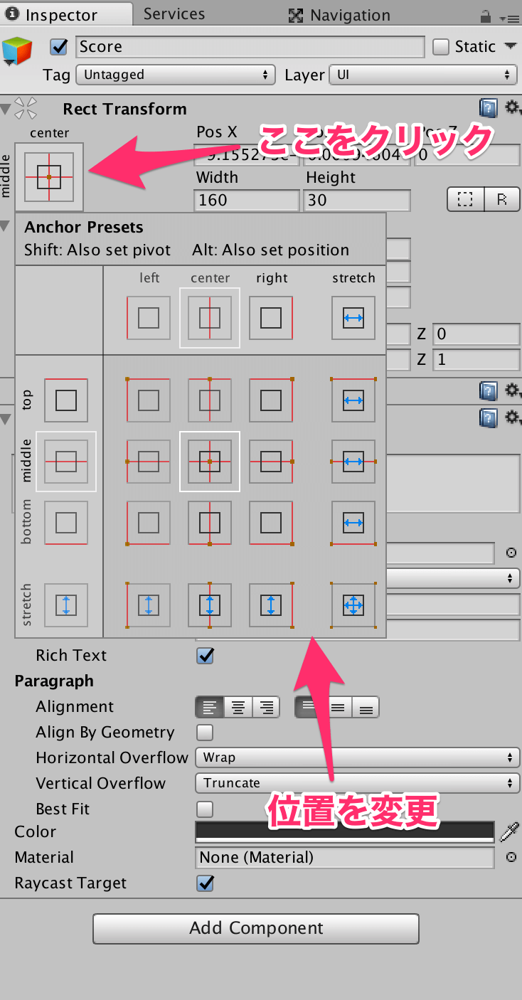
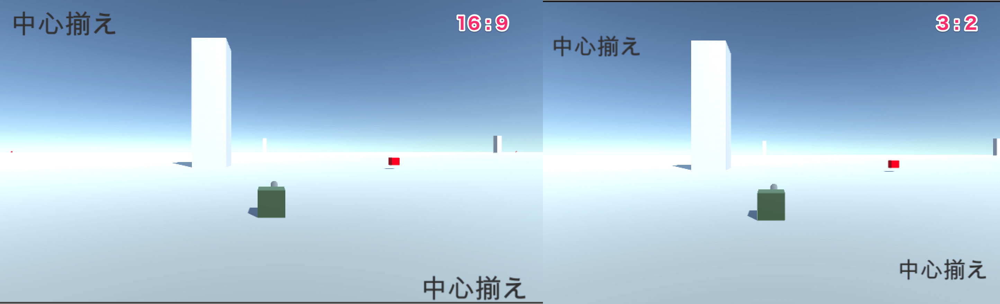
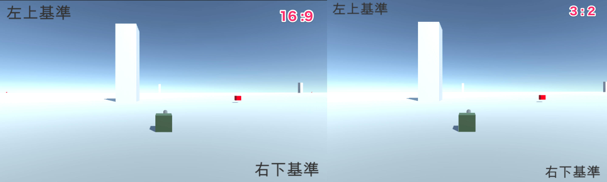
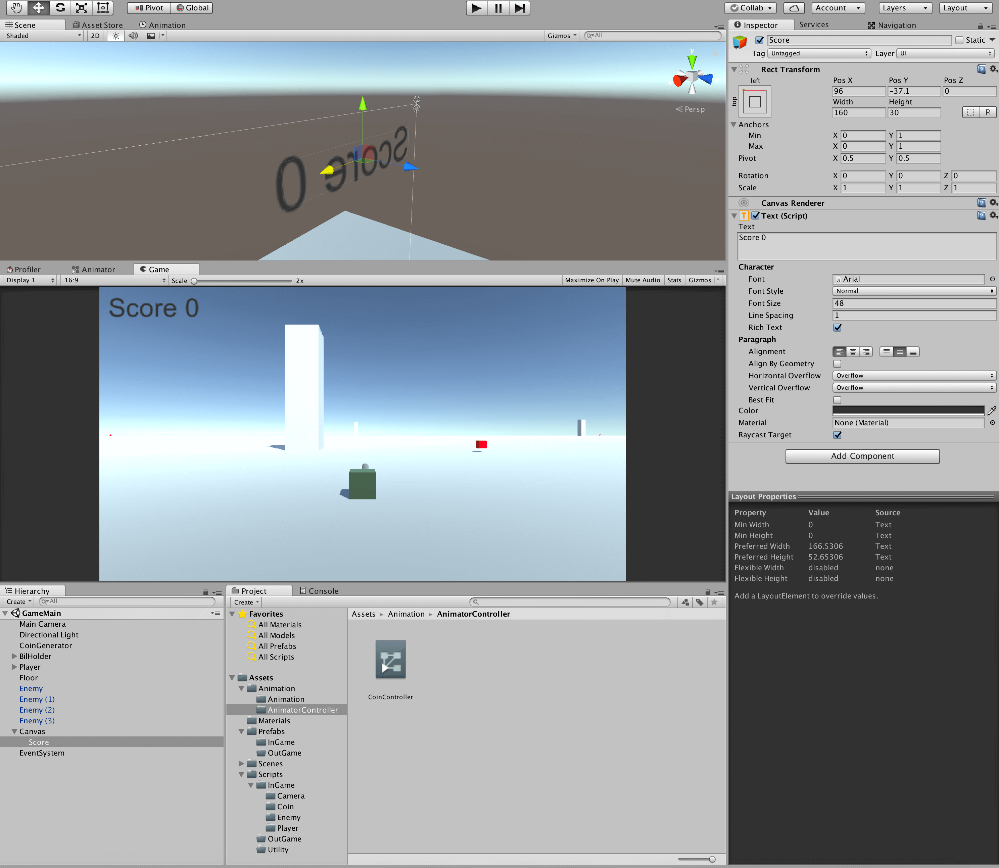

## 13. UIを作ろう

今回は、ゲームにおいて最も重要な要素の一つであるUIを作っていきましょう。  
UIにおいて、まず大事な *Canvas* を作りましょう。  
Canvasは、ヒエラルキー上で右クリックし、UI→Canvasの順で選択すれば作成されます。  



では、作成されたCanvasをインスペクタで見てみましょう。  
この中でまず重要なのは、CanvasコンポーネントのRender Modeです。  
これは、Canvasをどのように扱いたいかを変更できます。  
通常の状態(Screen Space - Overlay)では、Canvasは常に最前面に、カメラの位置に関係なく表示されます。  
基本的には、Render Modeはこれでよいのですが、変えなければいけない場面というのもそのうち出てくると思うので、そのときのために学んでおくと良いでしょう。  
詳しくは、[Canvas](https://docs.unity3d.com/jp/current/Manual/UICanvas.html)
を見てください。  

次に、重要なのが、CanvasScalerコンポーネントです。  
ここでは、Canvasのスケールをどのように扱うかを決めます。  
具体的には、最近はスマートフォン向けにゲームを作ることが流行っているかと思いますが、スマートフォンのサイズはどれも同じわけではないです。  
その際に、開発者が想定しているスクリーンサイズではないサイズの端末を使った際に、UIをどのようにするかを決めます。  
通常のUI Scale Modeは、Constant Pixel Sizeになっています。  
これは、UIの位置やサイズはスクリーン上のピクセルに合わせて決まるということです。  
これでは端末によってサイズが変わってくれないため、通常は **ScaleWithScreenSize**　というモードを利用することが多いかと思います。  
これによって、位置とサイズが指定された基準となる解像度にしたがって、それより大きい場合や小さい場合もスケールされます。  
例えば、iphone5を対象としてゲームを作成した場合、基準となる解像度は、640×1136となるので、そのように設定します。  
今回のゲームでは、16:9を基準にしたいため、960×540くらいにしておきましょう。  
またScreen Match Modeは、どのようにUIをスケールするのかを決めます。  
私は、普段はExpandを使用しています。  



Canvasに関する設定は大体これで完了です。  

では、次に取得したコインの枚数を表示するようなテキストを表示してみましょう。  
テキストは、先程と同様にヒエラルキー上で右クリックして、UI→Textで作成できます。  
作成すると、画面上にNewTextという文字が出るかと思います。  
作成したTextをクリックして、インスペクタから値を変えていきましょう。

New Textと書いてある欄に文字を入力すると、好きな文字を表示することができます。

また、FontSizeの数字を変更すると、文字を大きくできます。  
このとき、サイズを大きくしすぎると文字が急に映らなくなってしまうかと思います。  
これは、Fontが表示できる領域を超えてしまっているだけなので、インスペクタ上部の *WidthとHeightを大きくする* か、下の方の *Horizontal OverflowとVertical OverflowをOverflowに* すればよいです。  

また、Alignmentという欄で、文字を左詰めにするか中央揃えにするか右詰めにするかを決めることが出来ます。  

Fontの色に関しても、Colorを押して、カラーパレットから任意の色に変えることが出来ます。  

Fontに関しては、このように覚えることが多いですが、その分自由度が高いということなので、使いながら慣れていきましょう。  



次に、UIに共通して重要な **Anchor** について説明します。  
Anchorとは、CanvasをスケールしたときにそのUIはどこを基準に位置を考えるかに使います。  
通常の状態では、画面中心にピボット(基準点)が置かれています。  
以下のように、パネルを押すと、好きな位置に変えることができます。  



以下に、具体的な例を示します。  





１枚目がピボットを両方中心においてあるときで、このときは画面比率が変わると、中心を基準にして位置が変わっているため左上と右下に余白ができていることがわかります。  
2枚目はピボットを左上のテキストは左上に、右下のテキストは右下に置いたときにです。  
このときは、画面比率が変わったとしても、余白ができていないことがわかるかと思います。  

このように、画面比率が変わって引き伸ばされた際に不自然の内容にピボットを決めましょう。  

今回は、コインのスコアは左上に表示するとして、ピボットは左上に置いておくことにしましょう。  
また、フォントサイズ等の設定は以下のようにしましょう。  



では、今度はこの作成したテキストをスクリプト側から変更してみましょう。  
今回は、コインを取ったときにスコアの表示を増やします。  
以前作成したPlayerStatus.csを以下のように変更しましょう。  

````cs
using UnityEngine;
using System.Collections;
using UnityEngine.UI;

public class PlayerStatus : MonoBehaviour {

    private int coin_num_;

    [SerializeField]
    private Text score_text_;

    private void Awake() {
        coin_num_ = 0;
    }

    private void OnTriggerEnter(Collider other) {

        //もし、衝突対象がコインなら
        if (other.tag == "Coin") {
            ++coin_num_;
            score_text_.text = "Score " + coin_num_;
        }

    }

    private void OnCollisionEnter(Collision other) {

        if (other.transform.tag == "Enemy") {
            //ゲームオーバー
            Destroy(gameObject);
        }

    }
}
````

まず、UnityEngine.UIをusingしておきましょう。  
テキストをスクリプト側からいじるためには、いじりたいテキストを与えてやる必要があるので、SerializeFieldで宣言して、インスペクタ上でScoreを与えてやりましょう。  
テキストの内容は、変数名.textに、変更したいテキストの文字列を代入してやれば完了です。  
今回は、コインの枚数が増えた際にスコアを増やしています。  

それでは、実行してコインを取ってみましょう。  
コインをとって、スコアの表示が増えたら完成です。  


[←コルーチンを使おう](./UseCoroutine.md) | [シーンを遷移しよう→](./UseScene.md)

[目次に戻る](../../README.md)  
