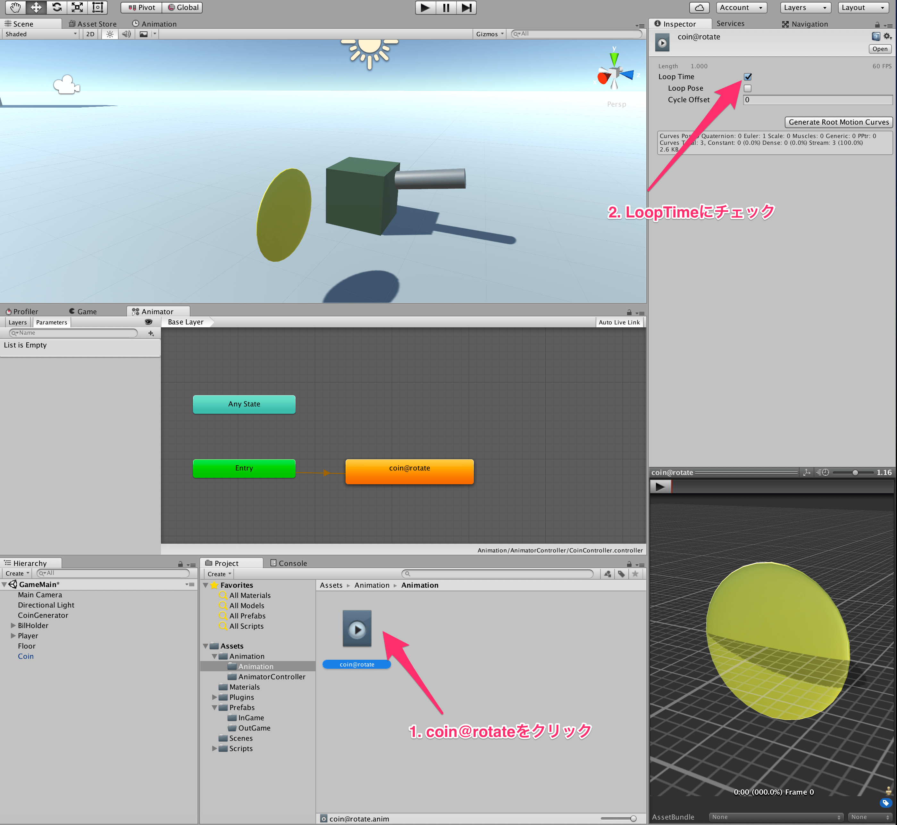

## 7. Animatorを使ってみよう

今回は、Unityのアニメーション周りのための機能である、*Animation* と *AnimatorController* について説明します。  
以前に作成したコインに関して、常に回転しているようなアニメーションをつけてみたいと思います。  

まずは、コインのプレハブをヒエラルキーにおいて、コインをフィールドに一つ生成しておきましょう。  
次に、置いたコインに対して、新しいコンポーネントであるAnimatorを追加しましょう。  
新しいコンポーネントの追加方法は、コインをクリックして、インスペクタ上のAddComponentというボタンを押すと追加したいものを選択できます。

次に、プロジェクト上で右クリックして、AnimatorControllerとAnimationを作成してみましょう。  
それぞれの名前は、CoinControllerと、coin@rotateにしておきましょう。  

それぞれについて軽く説明すると、Animationはその名の通り、その3Dモデルであったり、2D画像のアニメーションを管理します。  
具体的な例を出すと、例えば、勇者が歩くアニメーションと、走るアニメーションと、攻撃するアニメーションがあるとします。  
そういうときはAnimationを３つ作成して、yuusya@walk,yuusya@run,yuusya@attackのようにします。  
そして、できた3つのAnimationに対して、どのようなときにどのアニメーションを使用するかを管理するのが、AnimatorControllerです。  
例えば、Bボタンを押したらwalkアニメーションから、runアニメーションに遷移して、Aボタンを押したらどんなときでもattackアニメーションに遷移する。などを管理します。  
最後に、Animatorは、AnimatorControllerを適用するためのコンポーネントです。  
AnimatorControllerを適用するためには、Animatorが必要、という程度の認識で良いと思います。

では、コインの回転するAnimationについて作成してみましょう。  
まず、先程コインに対してつけたAnimatorコンポーネントに対して、CoinControllerを適用させておきましょう。

この状態で、Animatorウィンドウを開きます。  
Animatorウィンドウは、UnityのWindowメニューから、Animatorをクリックすると表示できると思います。  
また、あとでAnimationウィンドウも使用するので、そちらも開いておきましょう。
すると、以下の画像のようなものが表示されているかと思います。  
されていない場合は、ヒエラルキー上のコインをクリックしてみましょう。  

では、次にAnimatorウィンドウに対して、coin@rotateアニメーションをドラッグ・アンド・ドロップしてみましょう。  
すると、以下のような画像の状態になったかと思います。  
これについて軽く説明すると、現在の状態はEntryの状態から直接coin@rotateに遷移している状態で、つまり、コインが生成された直後にはコインが回転しているアニメーションが再生される状態に遷移するわけです。  
ただし、まだcoin@rotateは何も作成していない状態なので、今のままだと何も起きません。  

次に、coin@rotateに対して、コインが回転するようなアニメーションを作成してみましょう。  
まず、コインをクリックしたあとに、Animationウィンドウを確認すると、以下のような状態になっているかと思います。  
ここの、AddPropertyを押して、Transformをクリックして、Rotateの横の+を押しましょう。

これで、コインの回転に関してアニメーションでいじれるようになりました。  
やりたいことは、コインが1回転するようなアニメーションが作りたいわけです。  
そのために、アニメーション1回につきコインがy軸を中心に360度回ればよいので、そのようにアニメーションを作成してみましょう。  
ここからは少し複雑なので、以下のgifを参考にしてみてください。  
やっていることは、yの回転率を0.1ごとに60ずつ増やしているだけです。  

ここまでできたら、ゲームを再生してみましょう。  
すると、コインが1回転すると思います。コインがゲーム画面に写っていない場合は、コインをダブルクリックしてコインに注視したあと、シーンビューで確認しましょう。  
ただし、1回転しかしなかったかと思います。これは、coin@rotateの設定をインスペクタ上から、LoopTimeのチェックがついているようにいじれば良いです。

もう一度再生すると、コインがずっと回転しているかと思います。  
ここまでできたら、この設定をコインのプレハブにも反映させておきましょう。  
現在の状態だと、シーン上においてあるコインのみにAnimatorが付いている状態になっているかと思います。  
そこで、シーン上のコインをクリックして、インスペクタのApplyをクリックすることで、コインのPrefabにもその設定が共有されます。

最後に、シーン上においてあるコインは削除しておきましょう。

[←Prefabを作ろう](./MakePrefab.md) | [Rigidbodyを使ってみよう→](./UseRigidbody.md)

[目次に戻る](../../README.md)  
