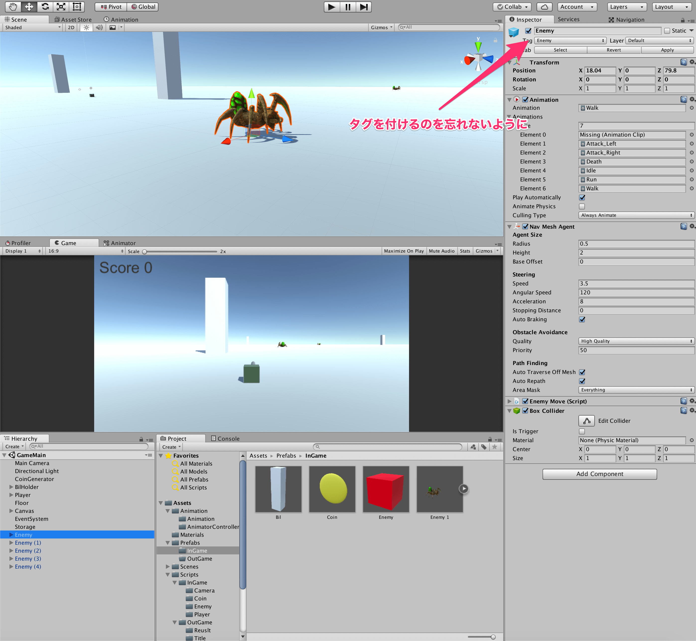
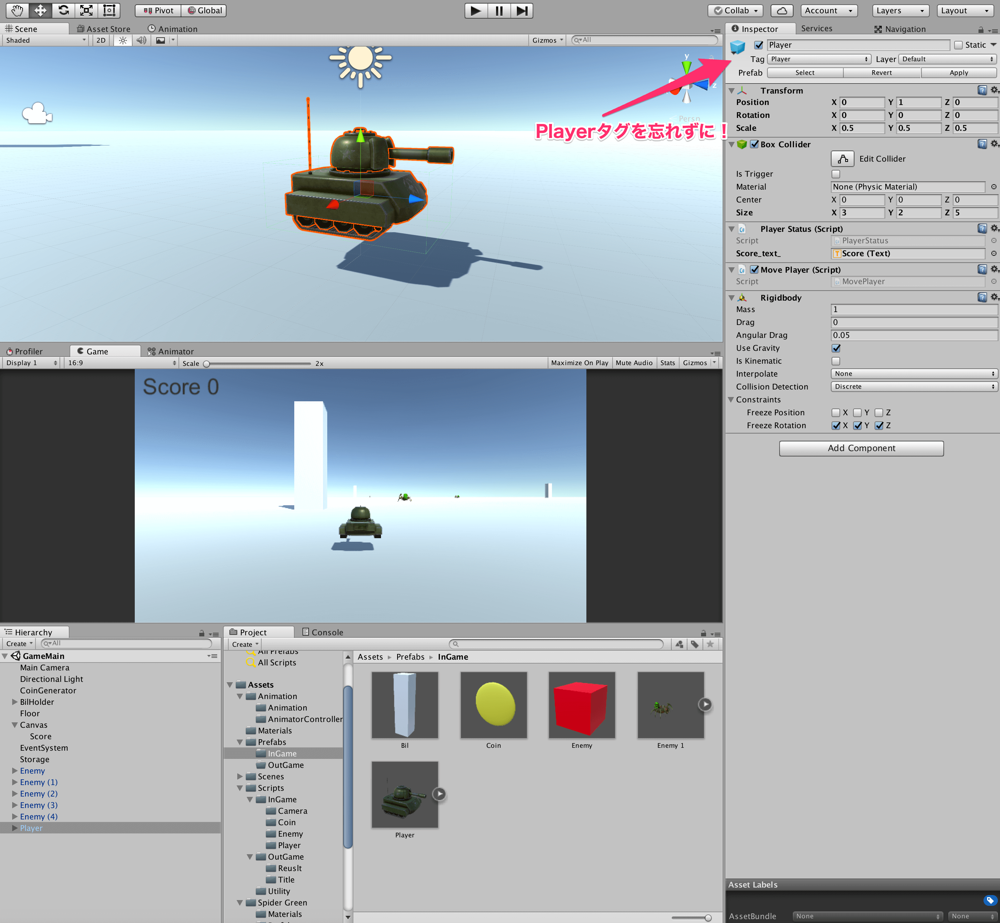
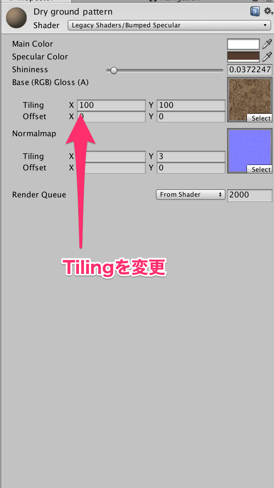
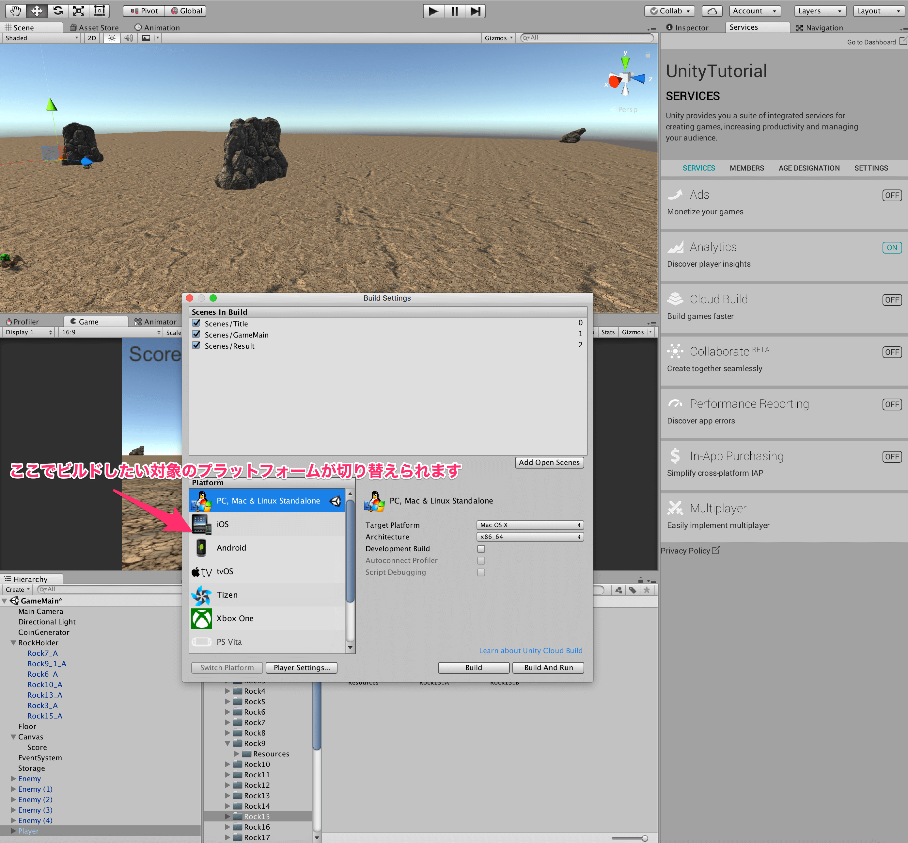

## 15. 見栄えを良くしよう

最後の仕上げです。  
ゲームの見栄えを良くしてみましょう。  
今回は、Asset Storeを利用していきましょう。  

Asset Storeとは、Unity内で利用できる3Dモデルやテクスチャ、スクリプトなどが購入できるものです。  
その中には、無料で配布されているものもあり、無料でも十分クオリティが高いものが手にはいります。  

まずは、敵を[Spider Green](https://www.assetstore.unity3d.com/jp/#!/content/11869)に置き換えておきましょう。  
基本的に、以前作成したEnemyと同様のコンポーネントをくっつけておけば良いです。  

自機は[ToonTank](http://u3d.as/odw)を利用させてもらいましょう。  
先程のEnemyと同様に、もともとPlayerについていたコンポーネントを全て付け替えて起きましょう。  
戦車が少し大きめなので、Scaleを全て0.5にしておきましょう。  
また、BoxColliderのスケールを調整して、自機の当たり判定をしっかりと作っておきましょう。  

次に、地面のマテリアルを変更しておきましょう。  
今回は、[Yughues Free Ground Materials](https://www.assetstore.unity3d.com/jp/#!/content/13001)
の中の、Dry ground patternというマテリアルを利用させてもらいました。  
このとき、マテリアルのTilingを100×100に変更しましょう。  
Tilingではマテリアルのテクスチャをどれだけ並べるかを決めることが出来ます。  
今回は、100×100の床なのでこのようにしました。

最後に、ビルを[Rock & Boulders](https://www.assetstore.unity3d.com/jp/#!/content/2452)に置き換えましょう。  
適当にRockを配置していきましょう。  
配置をし終えたら、NavMeshをBakeし直しましょう。  

これでひとまずゲームは完成です！  

最後にBuildの仕方を教えます。  
シーンを追加する際に開いたBuild Settingから、Buildボタンを押すだけです。  
また、SwitchPlatformというもので対象となるプラットフォームを切り替えます。  

今回の制作の過程で使用できなかった重要なものとしては、
* Sound周り(AudioSource, AudioListener)
* Resources.Load
* UIのImage
* 2Dゲーム周り(Sprite, SpritePacker)

などがあるかと思います。  

Unityは、ゲーム会社でも活発に利用されていて、個人開発者も非常にたくさんいるので情報は潤沢です。  
わからないことがあれば、わからない単語で検索して見ましょう。  
そうすれば、大体のことは解決できます。  

ここからは、各々でゲームを改善したり、新しいゲームを作って学んでいきましょう。

[←シーンを遷移しよう](./UseScene.md)

[目次に戻る](../../README.md)  
