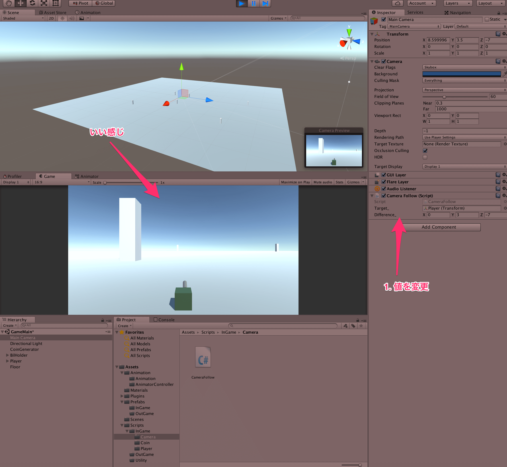

## 8. Rigidbodyを使ってみよう

今回は、よりゲームっぽくなるようにステージ上を歩き回ってみよう。  
今のままだと、プレイヤーに対してカメラが追従していないため、画面外にプレイヤーが行ってしまう。  
そこで、まずはカメラが特定のオブジェクトに対して追従するようなスクリプトを作成してみよう。  
以下にそのスクリプトを示す。  

````cs
using UnityEngine;
using System.Collections;

public class CameraFollow : MonoBehaviour {

    [SerializeField]
    private Transform target_;

    [SerializeField]
    private Vector3 difference_;

    private void LateUpdate() {
        transform.position = target_.position + difference_;
    }
}
````

プログラム自体は非常に短く、単純である。  

まず、変数targetについて説明すると、これはカメラの追従対象となるオブジェクトである。  
以前伝えたように、オブジェクトの位置や回転、スケールを操るのはTransformである。  
そのため、オブジェクトのTransformが得られれば、そのオブジェクトの位置も手に入る。  

次に、Vector3型の変数differenceは、カメラとその追従対象との距離を補正する。  
プレイヤーの位置にカメラが行ってしまうと、カメラにプレイヤーが映らなくなってしまう。  
もちろん、FPS系のゲームを作りたいのであれば、それで良いのだが今回は違うので、カメラとプレイヤーに関して少し距離を取る必要がある。  
その距離をインスペクタ上でいじれるようにするために変数として持っている。  

また、どちらも以前説明したようにSerializeField属性が付いている。  
これは、インスペクタからそれぞれの値がいじれるようにするためで、これがついていないとインスペクタ側から値がいじれなくなってしまう。  

最後に、LateUpdate関数が定義されている。  
これは、以前のUpdateと同様に、Unity側から呼び出されるイベント関数で、全てのUpdateの後に呼ばれる。  
ここでは、カメラの座標を、追従したいオブジェクトの座標と補正分を足した座標に変更している。  
なぜ、UpdateではなくLateUpdateかというと、追従したい対象が移動したあとに、カメラの座標を変更したいからである。  
もし、Updateを使用すると、カメラの追従スクリプトか、追従したい対象の移動するスクリプトのどちらのUpdateが先に呼ばれるかがわからないため、もしかしたらカメラの位置を変えた後に、追従したい対象が移動してしまう可能性もある。  
今回は、それを考慮してLateUpdateを使用している。

ここまでできたら、このスクリプトをカメラにアタッチして、ゲームを実行してみよう。  
すると、以下のように、プレイヤーとカメラの位置が常に同じになるような動きをすると思われる。  


ここで、先程作成したdifference変数の値をx: 0 y : 3 z: -7に変更してみよう。  
すると、以下のようにプレイヤーの少し後ろからカメラが写すような感じになったと思われる。  



ここで、一旦ゲームを停止して、もう一度再生してみよう。  
すると、値を変更する前に戻ってしまっていると思われる。  
**Unityエディタでゲームの実行中に与えた変更は、ゲームを停止したときには戻ってしまう** ことが原因である。  
これは、初心者のうちは非常にやりがちなミスで、注意が必要である。  
ゲームの開始後にいちいち値を変更したくはないので、ゲームを開始する前にdifferenceの値を先程の値に変更しておきましょう。　　

さて、この状態でゲームを再生し、ビルにぶつかってみましょう。  
ビルが置いてないよって人は、いくつか適当な位置に配置しておきましょう。  
すると、プレイヤーがビルをすり抜けてしまったと思います。  
原因は、transformを直接いじって移動させているからです。  
**transformをいじって与えた変更は、物理法則には従わない変更** になってしまうので注意しましょう。  

そもそも当たり判定がついているのか？と疑問に思う方もいるかもしれませんが、ついています。  
プレイヤーやビルをクリックして、インスペクタを見ると、なんちゃらColliderというものがついているかと思います。　　
これが、当たり判定を取るためのコンポーネントです。


これがついているものは衝突判定がとれるわけです。  
今回は、ビルもプレイヤーもプリミティブオブジェクトから作成したと思いますが、プリミティブオブジェクトには最初からその形に対応するように当たり判定がついているのです。  
逆に言えば、これからゲームを作る中で自分の作成したモデルを使う場合には、自分でColliderをアタッチしてやる必要が有るので注意しましょう。  

さて、では物理法則に従って物体を移動させてやるにはどうすればいいのでしょうか？  
そういう場合はRigidbodyコンポーネントを使います。  
使い方は簡単で、物理法則に従って移動させたい物体にRigidbodyコンポーネントをアタッチすればよいのです。  
今回は、プレイヤーに対してアタッチしたいので、プレイヤーをクリックして、AddComponentからRigidbodyを検索して、アタッチしましょう。  


あとは、スクリプト側からRigidbodyを使って移動するように変更します。  
以前作成した、MovePlayerスクリプトを以下のように変更しましょう。

````cs
using UnityEngine;
using System.Collections;

public class MovePlayer : MonoBehaviour {

    private const float move_speed_ = 10.0f;

    private Rigidbody rgbd_;

    private void Awake() {
        rgbd_ = GetComponent<Rigidbody>();
    }

    private void Update() {

        if (Input.GetKey(KeyCode.LeftArrow)) {
            Vector3 vel = rgbd_.velocity;
            vel.x = -move_speed_;
            rgbd_.velocity = vel;
        } else if (Input.GetKey(KeyCode.RightArrow)) {
            Vector3 vel = rgbd_.velocity;
            vel.x = move_speed_;
            rgbd_.velocity = vel;
        } else if (Input.GetKey(KeyCode.DownArrow)) {
            Vector3 vel = rgbd_.velocity;
            vel.z = -move_speed_;
            rgbd_.velocity = vel;
        } else if (Input.GetKey(KeyCode.UpArrow)) {
            Vector3 vel = rgbd_.velocity;
            vel.z = move_speed_;
            rgbd_.velocity = vel;
        } else {
            //キーを押していないときは速度0
            rgbd_.velocity = Vector3.zero;
        }
    }
}
````

今回のスクリプトで、非常に重要なのは *GetCompoent* というメソッドです。  
これは、このスクリプト(MovePlayer)がアタッチされているオブジェクトについている **他のコンポーネントを取得することができる** ものです。  
今回は、Rigidbodyコンポーネントがこのスクリプトでいじりたかったので、GetCompoentで取得しているわけです。  
このGetCompoentというメソッドはそこそこ重いので、Update内では極力使用しないようにしましょう。  

今回は、Unityのイベント関数である、Awake関数内でGetCompoentをして、変数にキャッシュすることで、何度も呼び出すことを避けています。  
Awakeについて説明すると、これはオブジェクトがInstantiateされた直後に呼び出されるもので、コンストラクタのような感じで使用してください。  
よくわからなくなってしまうのが、Start関数との使い分けで、StartははじめてUpdate関数が呼ばれるフレームの直前に呼ばれます。  
基本的にはAwake,Startの順で呼ばれると考えて、他のStartよりも絶対先に実行してほしい内容をAwakeに書くようにすれば良いでしょう。

そして、キャッシュしたRigidbodyからvelocity(速度)を取得して、以前のtransform.positionを変更したときとほぼ同様に変更しています。  

この状態で、ゲームを実行してみましょう。  
すると、プレイヤーがころころ転がってしまったかと思います。  
これは、プレイヤーに対して速度を与えたときに、抵抗により回転しまっているのです。  
これを防ぐために、インスペクタからPlayerのRigidbodyを見て、Constraintsという欄をクリックして、FreezeRotationのx,y,zにそれぞれチェックをしましょう。  
これにより、物理法則によるx,y,z方向の回転を防ぐことができます。  


この状態でゲームを実行してみましょう。  
すると、ビルにぶつかってもすり抜けなくなったと思います。
プレイヤーの移動速度が遅いと感じる人は、スクリプトからmove_speed_を変更してみましょう。

[←Animatorを使ってみよう](./UseAnimator.md) | [衝突判定のイベントについて学ぼう→](./LearnBounds.md)

[目次に戻る](../../README.md)  
