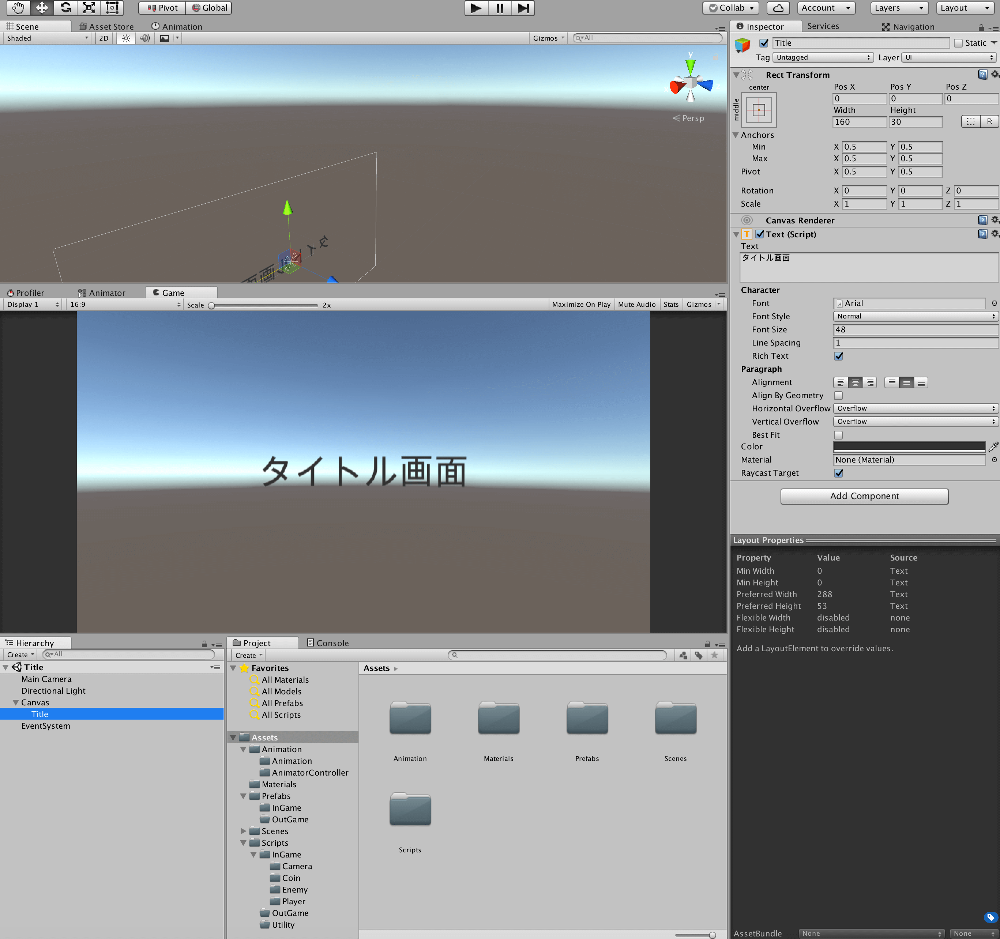
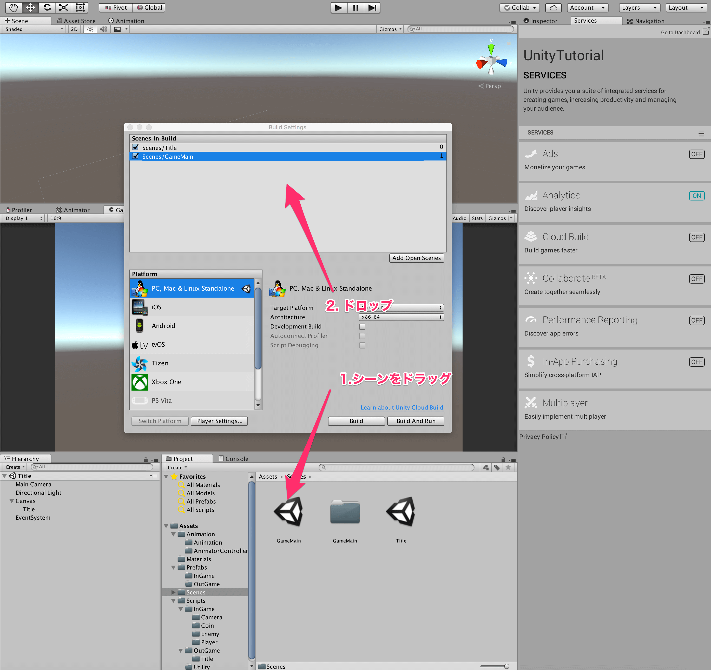

## 14. シーン遷移をしよう

今回は、タイトル画面とリザルトを作って、シーン遷移の方法を学んで行きましょう。  
新しいシーンはCtrl + n (Command + S)で作成出来ます。  
今回は、簡易的にCanvasとTextでタイトルだということがわかるようにだけしておきましょう。  
前回学んだことを活かして、文字のサイズや位置を上手く調整して作ってみましょう。  



作成できたら、Ctrl + S でシーンを保存しておきましょう。  
このままでは、タイトルから遷移ができないのでスクリプトを書きましょう。
TitleManager.csというスクリプトを以下に示します。

````cs
using System.Collections;
using System.Collections.Generic;
using UnityEngine;
using UnityEngine.SceneManagement;

public class TitleManager : MonoBehaviour {

    private void Update() {

        if (Input.GetKeyDown(KeyCode.Return)) {
            SceneManager.LoadScene("GameMain");
        }
    }
}
````

まず、UnityEngine.SceneManagementをusingしておきます。  
シーン遷移は、SceneManagerのLoadSceneメソッドを呼びます。  
引数には、遷移したい先のシーン名を入力します。  
このスクリプトをカメラなり、空のオブジェクトなりにオッケーです！と言いたいのですが、その前にもう一つだけやることがあります。  

Unityのメニューから、File →　Build Settingを開きます。  
開いたら、作成してあるシーンをドラッグ・アンド・ドロップしましょう。  
このとき、一番上にあるシーンがビルドした後のゲームの起動時に初めに遷移するシーンになります。  
なので、基本的には Title →　GameMain →　Result のような順でドラッグ・アンド・ドロップしておきましょう。  



では、ゲームを起動してみましょう。  
その後、タイトル画面でエンターキーを押すと、ゲーム画面に遷移すると思います。  

次に、プレイヤーが敵にぶつかった際にリザルトシーンに遷移して、結果を表示するようにしましょう。  
まずは、先ほどと同様にリザルトシーンを作ってみましょう。  
その際に、コインの枚数の結果を表示するようなテキストを用意しておきましょう。  

そして、先程と同様なResultManager.csというスクリプトを作成し、また適当な空のオブジェクトかカメラにでもつけておきましょう。  
また、Build Settingにシーンを登録するのを忘れないようにしましょう。  

さてここで一つ問題があります。  
ゲーム中に取得したコインの枚数をどうやってリザルトシーンに受け渡すかです。  
シーンを遷移すると、基本的にはオブジェクトは全て破棄されるため、そのオブジェクトについていたスクリプトの値も破棄されてしまうのです。  

いくつか方法があるのですが、今回はDontDestroyOnLoadを用いる方法を使ってみましょう。  
DontDestroyOnLoadの引数にとったObjectは、シーンを遷移しても消えなくなるのです。  
では、今回用いる簡易的なデータ共有スクリプトStorage.csを以下に示します。

````cs
using System.Collections;
using System.Collections.Generic;
using UnityEngine;

public class Storage : MonoBehaviour {

    public int coin_num_;

    private void Start() {
        DontDestroyOnLoad(gameObject);
    }

}
````

Storageという空のオブジェクトを作って、上記のスクリプトをアタッチしておきましょう。  

そして、PlayerStatusオブジェクトを以下のようにしておきましょう。  

````cs
using UnityEngine;
using System.Collections;
using UnityEngine.UI;
using UnityEngine.SceneManagement;

public class PlayerStatus : MonoBehaviour {

    private int coin_num_;

    [SerializeField]
    private Text score_text_;

    private void Awake() {
        coin_num_ = 0;
    }

    private void OnTriggerEnter(Collider other) {

        //もし、衝突対象がコインなら
        if (other.tag == "Coin") {
            ++coin_num_;
            score_text_.text = "Score " + coin_num_;
        }

    }

    private void OnCollisionEnter(Collision other) {

        if (other.transform.tag == "Enemy") {

            GameObject.Find("Storage").GetComponent<Storage>().coin_num_ = coin_num_;

            //ゲームオーバー
            Destroy(gameObject);

            SceneManager.LoadScene("Result");
        }

    }
}
````

以前のPlayerStatusに対して2行追加しました。  
GameObject.Findは、引数に取った名前のオブジェクトを探し出し、取得するメソッドです。  
これにより、いつものようにSerializeFieldで予めオブジェクトをくっつけておくことなく、動的に取得できるのです。  
しかし、このメソッドはそこそこ重たい処理をしているため、Update内で使用するようなことはないようにしましょう。　　
GameObject.Find("Storage")によって、Storageオブジェクトが取得できたら、その取得できたStorageオブジェクトについているStorageスクリプトをGetComponentにて取得します。  
そして、そのメンバ変数であるcoin_num_に、プレイヤーが死んだときに持っていたコインの枚数を代入します。
最後に、リザルトに遷移します。

そして、リザルトでこの値を使用して結果を表示してみたいと思います。  
先程作成したResultManager.csスクリプトを以下のように書き換えましょう。  

````cs
using System.Collections;
using System.Collections.Generic;
using UnityEngine;
using UnityEngine.SceneManagement;
using UnityEngine.UI;

public class ResultManager : MonoBehaviour {

    [SerializeField]
    private Text result_;

    private void Start() {
        int coin_num_ = GameObject.Find("Storage").GetComponent<Storage>().coin_num_;

        result_.text = "Score " + coin_num_;
    }

    private void Update() {

        if (Input.GetKeyDown(KeyCode.Return)) {
            SceneManager.LoadScene("Title");
        }
    }
}
````

これで、ゲーム中に取得したコインの枚数がリザルトに反映されるかと思います。  
一度ゲームを開始して、コインを集めてから敵にぶつかってみましょう。  
うまくコインの枚数が反映できていれば完成です。  

これで、一応ゲームとしての一通りの流れはできました。  
あとは次回以降で見栄えを良くしていきましょう！

[←UIを作ろう](./MakeUI.md) | [Next→](./LearnDebug.md)

[目次に戻る](../../README.md)  
