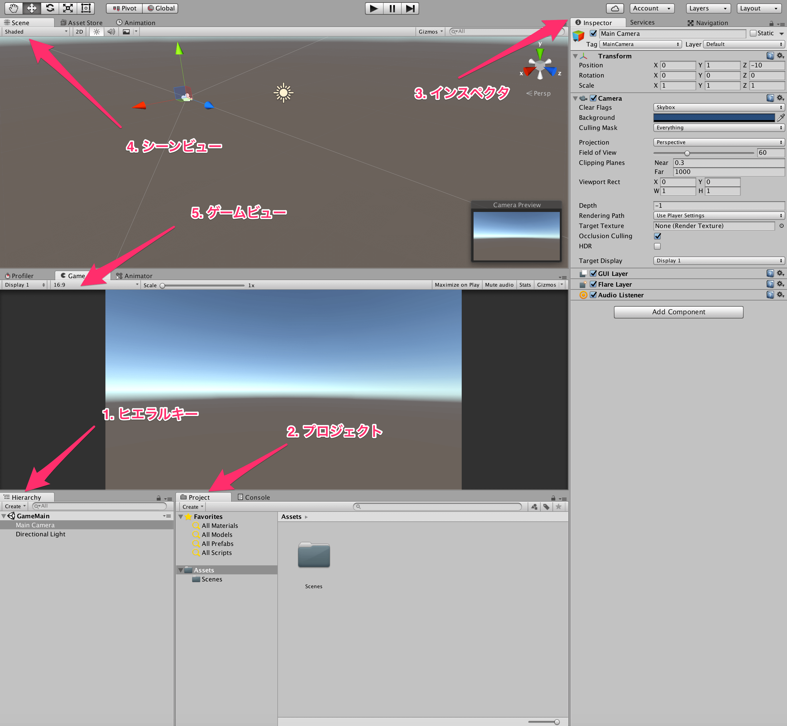
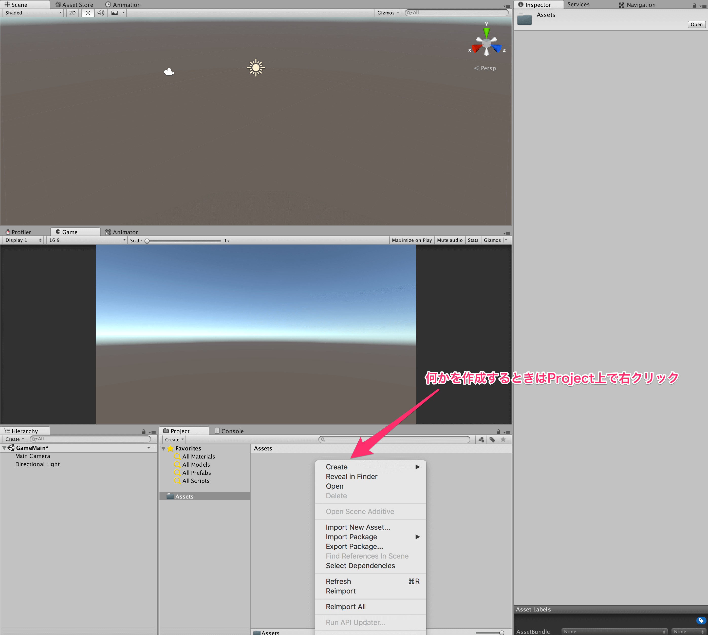
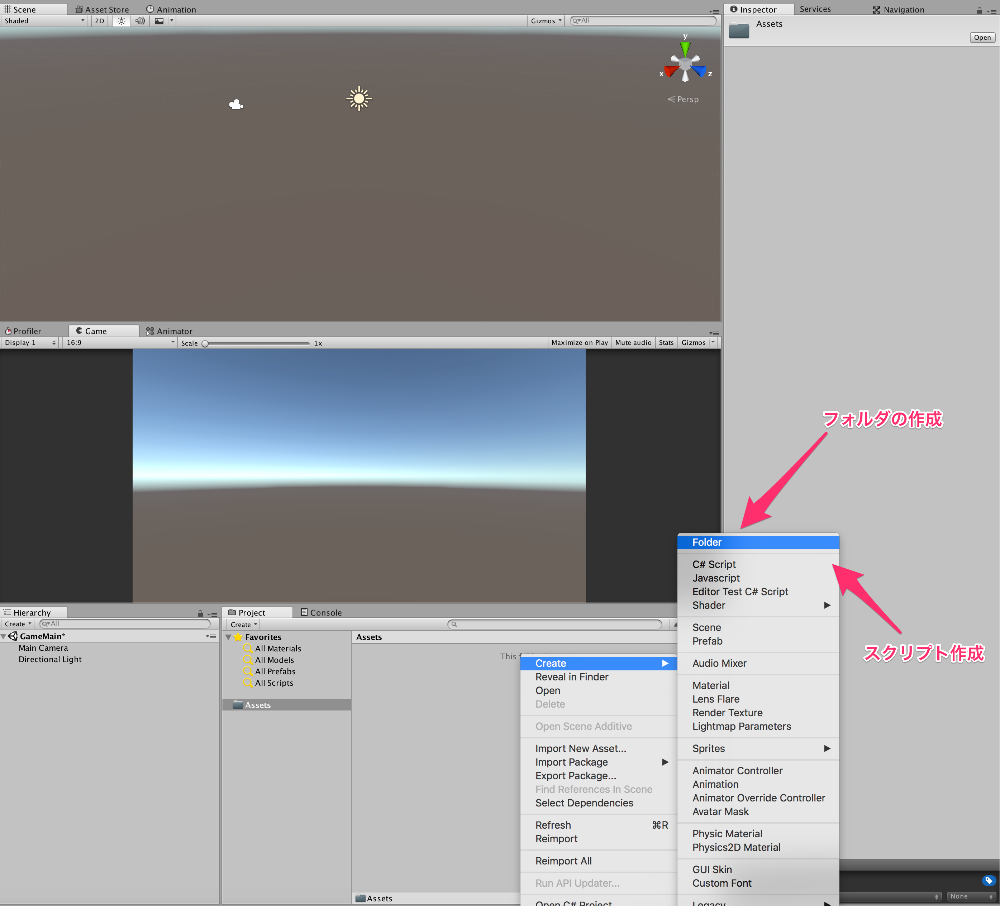
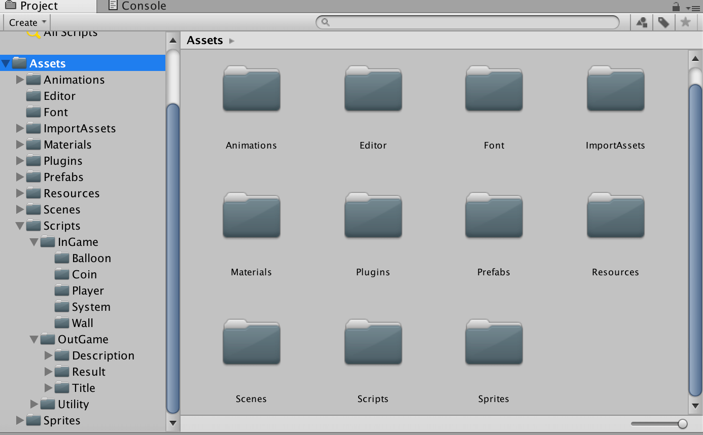

## 2. ウィンドウの概要とフォルダーの作成  
プロジェクトの作成が完了すると、以下のような画面になったかと思います。  

では、この画面について一つずつ説明をしていきます。  

1. ヒエラルキー  
ヒエラルキーは、ゲーム上においてあるものの一覧です。  
プロジェクトを作った初期状態では、MainCameraとDirectional Lightが配置されています。  
ゲームビューに画面が写っているのはカメラがあらかじめ配置してあるからで、その写っているものが明るいのはDirectional Lightが配置してあるからという訳です。  
ためしに、どちらかを消してみるとわかりやすいかもしれません。  
今後、何かゲーム上に配置したいとき(敵や自機とか)はここに放り投げます。

2. プロジェクト  
プロジェクトは、ゲームに含まれる素材やスクリプトの一覧です。  
作ったプロジェクトのAssetsファイル以下のものが表示されます。  
ここでは、ゲームに使用するためのものを管理したり、整理したりします。  
現在は、写真上では、Scenesフォルダが見えているかと思います。  
このように、フォルダを作成して、ゲームに必要なものをうまく整理しておくようにしましょう。  

3. インスペクタ  
インスペクタは、ゲームに配置されているオブジェクトのパラメーターを管理するためのウィンドウです。  
ヒエラルキー上の管理したいモノをクリックすると、インスペクタ上にそのモノの位置やスケール、角度、アタッチされているコンポーネントなどが表示されます。  
*値の変更* などもここから行うことができます。  
例えば、モデルを2倍にして、z軸中心に90度回転させたい！ってときはスクリプトを書かなくてもここで値を変えればよいわけです。  

4. シーンビュー  
シーンビューは、ゲーム上に配置されているオブジェクトが全て表示されます。  
つまり、ヒエラルキー上に並んでいるオブジェクト達が実際にどのように配置されているかが見えるわけです。  

5. ゲームビュー  
ゲームビューは、シーンビューとは違い、**シーン上に配置されているカメラから見たもの** が表示されます。  
つまり、カメラがない場合はなにも表示されないわけです。  
普段のゲームのプレイで見えるものは、この画面に表示されているものになるわけです。  
プレイヤーを配置したとして、そのプレイヤーに対してカメラを追従するようにしないと、そのプレイヤーは見えなくなってしまう…と言ったような感じです。

次に、フォルダの作成方法について説明します。  
フォルダを作成するには、プロジェクトビュー上で右クリックをします。  
すると、メニュー一覧が出てくると思います。  

その中からCreateにカーソルを合わせると、作成できるものの一覧が表示されます。  
その中の、Folderをクリックすると作成できます。

 

今後、スクリプトやマテリアルの作成をする場合にもこの手順を踏むことになるので覚えておきましょう。  
プロジェクトが大きくなってくると整理が大変になってくるので、普段から細かくフォルダに分けて、開発を進めていくことを心がけましょう。

上の写真はBalloonCoin!のフォルダ分けの感じ  
あくまで参考程度にどうぞ  

[←プロジェクトの作成](./MakeProject.md) | [自機を作ろう！→](./MakePlayer.md)

[目次に戻る](../../README.md)  
