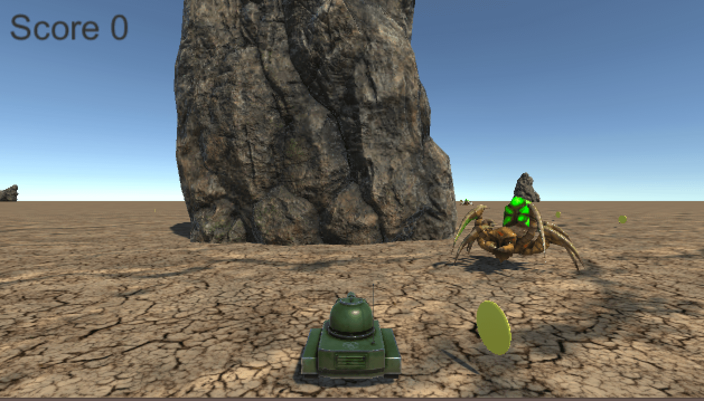

# Unity入門
## 初めに
こちらの資料は、[コンピュータクラブNITMic](http://nitmic.club.nitech.ac.jp/)内の部員向けハンズオンにて使用したものです。  
著者のUnity歴もまだ半年ちょっとと短いため、間違いも有るかと思いますが、どうかご了承ください。  
ちなみに、環境は
* Unity 5.5.0f3 Personal
* MacOSX

ですが、ショートカットキーについてなどはWindows向けにも記述したつもりです。

## できること

上記の写真は完成形です。  

この資料を全て読み終えたら、Unityにおいての開発のためのベース(2D,3D問わず)が出来上がっているようになってもらえることを目指してまとめました。  
ゲームに関しては、初めに思い描いていたものとだいぶ変わってしまったため、面白くなかったり、なぜ自機が戦車なのかとか違和感がたくさんあるかと思いますが許してください…  
また、文章で記述するには難しい機能も多く、なるべく写真を使って分かりやすくなるように心がけましたが、後半はだれてしまって少し写真の量も減ってしまっている感が否めません…  
わかりづらいところは、各々で検索してもらうか、僕にメールなりで質問してください！

## 目次
1. [プロジェクトの作成](./Document/ReadMe/MakeProject.md)
2. [ウィンドウの概要とフォルダーの作成  ](./Document/ReadMe/Window and folder.md)
3. [自機を作ろう](./Document/ReadMe/MakePlayer.md)
4. [マテリアルを作ろう](./Document/ReadMe/MakeMaterial.md)
5. [自機を操作しよう](./Document/ReadMe/ControllPlayer.md)
6. [Prefabを作ろう](./Document/ReadMe/MakePrefab.md)
7. [Animatorを使ってみよう](./Document/ReadMe/UseAnimator.md)
8. [Rigidbodyを使ってみよう](./Document/ReadMe/UseRigidbody.md)
9. [衝突判定のイベントについて学ぼう](./Document/ReadMe/LearnBounds.md)
10. [ログについて学ぼう](./Document/ReadMe/LearnDebug.md)
11. [敵を動かそう](./Document/ReadMe/MakeEnemy.md)
12. [コルーチンを使おう](./Document/ReadMe/UseCorou.md)
13. [UIを作ろう](./Document/ReadMe/MakeUI.md)
14. [シーンを遷移しよう](./Document/ReadMe/UseScene.md)
15. [見栄えを良くしよう](./Document/ReadMe/UseAsset.md)
